# Oscars Winners — Plan de implementación y prompts

Documento de trabajo para ejecutar [`spec.md`](spec.md) mediante una serie de prompts incrementales dirigidos a un LLM de generación de código, con enfoque TDD.

- **Compañero obligatorio**: `spec.md`. Los prompts citan sus secciones en lugar de repetirlas.
- **Estado de partida**: commit `6798d39`. Ver [sección 15 de `spec.md`](spec.md).

---

## 1. Cómo usar este documento

Cada prompt de la [sección 6](#6-prompts) es autocontenido y se entrega **en orden**, uno por sesión. Reglas de ejecución:

1. Antes de cada prompt, el repositorio está en verde: `npm run test` y `npm run build` pasan.
2. El LLM escribe primero las pruebas que fallan, luego el código que las hace pasar.
3. Ningún paso termina con código huérfano. Todo módulo nuevo queda consumido por algo existente en el mismo paso.
4. Al terminar cada paso se hace un commit con el mensaje sugerido en el prompt.
5. Si un paso no pasa sus pruebas, se corrige antes de avanzar. No se acumula deuda entre pasos.

---

## 2. Decisión de arquitectura que este plan resuelve

`spec.md` exige en [7. Detalle por edición](spec.md) que la vista de detalle sea **simultáneamente** un overlay sobre el grid y una página propia compartible e indexable. En el App Router de Next.js eso admite varias soluciones y conviene fijar una antes de repartir los pasos, porque condiciona varios de ellos.

**Opción elegida: el grid vive en el layout raíz.**

```
src/app/
├── layout.tsx        →  <Shell><YearGrid/>{children}</Shell>
├── page.tsx          →  null (el grid ya está en el layout)
├── [slug]/page.tsx   →  <CeremonyOverlay/>
└── not-found.tsx     →  <NotFoundOverlay/>
```

Por qué:

- El grid **no se desmonta** al navegar a una edición, así que la posición del scroll y el estado visual se conservan gratis. Es lo que hace que se sienta un modal y no una página nueva.
- Las 98 rutas siguen siendo páginas reales prerenderizadas, con su propio `generateMetadata`. Cumple SEO y compartibilidad.
- Funciona sin JavaScript: cada recuadro es un enlace a una página que existe.
- Evita la complejidad de las rutas interceptadas y paralelas, que además obligarían a mantener dos árboles de render para el caso de navegación directa.

Consecuencias que los pasos deben respetar:

- Los `<Link>` del grid usan `scroll={false}`.
- El layout carga `data/index.json`. Es estático, así que no tiene costo en runtime.
- `page.tsx` de la raíz devuelve `null` a propósito, y eso lleva un comentario explicando por qué.

**Alternativas descartadas:** rutas interceptadas (`@modal/(.)[slug]`), por complejidad y por duplicación del árbol de render; y un modal puramente cliente con `history.pushState`, porque rompería el prerenderizado de las 98 rutas.

---

## 3. Iteración del dimensionamiento

Se hicieron tres pasadas sobre la descomposición, aplicando este criterio:

> Un paso tiene el tamaño correcto si (a) se puede implementar con menos de ~300 líneas de código nuevo, (b) empieza con pruebas que fallan y son significativas, (c) deja el repositorio ejecutable y en verde, y (d) se integra con algo que ya existe.

### Pasada 1 — Fases

10 bloques temáticos: pruebas, categorías, normalización, fuente oficial, diseño, grid, detalle, móvil, SEO, fase 2. Demasiado gruesos: "normalización" por sí solo era una semana de trabajo sin puntos de verificación intermedios.

### Pasada 2 — Fragmentos

Se partieron en 22 fragmentos. Detectados tres problemas:

- **Normalización seguía siendo un bloque enorme.** Un solo paso mezclaba validación, unión de fuentes, agrupación y escritura de artefactos. Se partió en cuatro.
- **El scraper mezclaba dos riesgos distintos**: parsear HTML desconocido y hacer red con reintentos. Se separó en parser contra fixture guardado y, aparte, el cliente HTTP con su CLI. Así el parser se desarrolla con pruebas deterministas y sin red.
- **El grid mezclaba layout con animación.** La restricción de rendimiento del hover de [6.2 de `spec.md`](spec.md) merece su propio paso con su propia prueba de regresión.

### Pasada 3 — Pasos finales

28 pasos. Ajustes de esta pasada:

- Se movió la infraestructura de pruebas al paso 1. Sin ella ningún paso posterior puede ser TDD.
- Se movió el sistema de diseño **antes** del grid, para no construir componentes y luego reescribirles los estilos.
- Se añadió un paso dedicado a la tabla de etiquetas por época, porque [5.3 de `spec.md`](spec.md) la marca como tarea de verificación obligatoria contra la fuente oficial y no debe ir escondida dentro de otro paso.
- Se separó el `not-found` y el caso ambiguo de `/1930` en su propio paso; son reglas de negocio, no decoración.
- Los pasos 3 y 26 quedaron pequeños, y se aceptan así: el 3 desbloquea todo el pipeline y el 26 es un artefacto de datos independiente.

---

## 4. Mapa de dependencias

```mermaid
flowchart TD
    P1["1. Vitest"] --> P2["2. Tests ceremonias"]
    P2 --> P3["3. Tipos de categoria"]
    P3 --> P4["4. Diccionario"]
    P4 --> P5["5. Etiquetas por epoca"]
    P5 --> P6["6. Esquemas Zod"]
    P6 --> P7["7. Carga y union"]
    P7 --> P8["8. Agrupacion"]
    P8 --> P9["9. Artefactos y data:check"]
    P9 --> P10["10. Suite de integridad"]
    P10 --> P11["11. Parser oficial"]
    P11 --> P12["12. CLI sync"]
    P12 --> P13["13. Merge 97 y 98"]
    P13 --> P14["14. Sistema de diseno"]
    P14 --> P15["15. Shell y acceso a datos"]
    P15 --> P16["16. YearCard"]
    P16 --> P17["17. Grid y decadas"]
    P17 --> P18["18. Hover"]
    P18 --> P19["19. Ruta de detalle"]
    P19 --> P20["20. Overlay a11y"]
    P20 --> P21["21. Flechas"]
    P21 --> P22["22. not-found y 1930"]
    P22 --> P23["23. Movil"]
    P23 --> P24["24. SEO"]
    P24 --> P25["25. E2E"]
    P25 --> P26["26. search.json"]
    P26 --> P27["27. Buscador UI"]
    P27 --> P28["28. Posters y runbook"]
```



---

## 5. Los 28 pasos

| # | Paso | Entrega verificable |
|---|---|---|
| 1 | Infraestructura de pruebas | Vitest corriendo, primer test sobre `ordinalSuffix` |
| 2 | Pruebas de la tabla de ceremonias | Aserciones D1-D6 de `spec.md` en verde |
| 3 | Tipos y grupos de categorías | 9 grupos declarados con orden y etiqueta |
| 4 | Diccionario canónico | 34 nombres del dataset mapeados, alias normalizados |
| 5 | Etiquetas por época | `resolveCategoryLabel` con la tabla de 5.3 verificada |
| 6 | Esquemas Zod | Validación de fuente y artefactos |
| 7 | Carga y unión de la base histórica | `NominationRecord[]` con fail-fast |
| 8 | Agrupación en `CeremonyDetail` | Ganadores, nominados, grupos ordenados |
| 9 | Escritura de artefactos y `data:check` | `data/` generado y validable |
| 10 | Suite de integridad de datos | D1-D15 más verificación puntual |
| 11 | Parser de la fuente oficial | Parser contra fixture HTML committeado |
| 12 | CLI `sync:oscars` | Reintentos, diff y confirmación |
| 13 | Integración de las ediciones 97 y 98 | 98 ediciones completas en `data/` |
| 14 | Sistema de diseño | Tokens, tipografías, contraste AA auditado |
| 15 | Shell de la app y acceso a datos | Layout, footer legal, `ceremony-data.ts` |
| 16 | `YearCard` en reposo | Componente con pruebas |
| 17 | Grid y navegación de décadas | Pantalla principal funcional |
| 18 | Animación de hover | Con disciplina de temporizadores |
| 19 | Ruta de detalle | 98 rutas prerenderizadas |
| 20 | Accesibilidad del overlay | Foco atrapado, Esc, scroll lock |
| 21 | Navegación entre ediciones | Flechas y teclado |
| 22 | `not-found` y ambigüedad de 1930 | Reglas de runtime de 10.3 |
| 23 | Móvil | Rotación por `IntersectionObserver` |
| 24 | SEO | Metadata, sitemap, JSON-LD |
| 25 | Suite E2E | E1-E12 de `spec.md` |
| 26 | Generación de `search.json` | Índice con normalización de acentos |
| 27 | Buscador global | UI accesible por teclado |
| 28 | Pósters y runbook anual | Fase 2 cerrada |

Los pasos 1 a 25 son el MVP. Los pasos 26 a 28 son la fase 2.

---

## 6. Prompts

### Fase A — Fundamentos de prueba

#### Paso 1: Infraestructura de pruebas

```
Contexto: proyecto Next.js 15 con App Router, TypeScript y Tailwind v4 ya inicializado.
Existen src/lib/types.ts, src/data/ceremonies.ts y scripts/lib/cache.ts. No hay
infraestructura de pruebas todavía. La especificación completa está en spec.md.

Objetivo: dejar el proyecto listo para trabajar con TDD.

Tareas:
1. Instala y configura Vitest con soporte para TypeScript y para el alias "@/*"
   que ya existe en tsconfig.json. Usa el entorno "node" por defecto.
2. Crea vitest.config.ts. Los tests viven junto al código que prueban, como
   *.test.ts, salvo las pruebas de integridad de datos que irán en tests/data/.
3. Añade a package.json los scripts "test" y "test:watch".
4. Escribe src/data/ceremonies.test.ts con pruebas de la función ordinalSuffix ya
   existente, cubriendo: 1st, 2nd, 3rd, 4th, 11th, 12th, 13th, 21st, 22nd, 23rd,
   98th, 101st, 111th. Los casos 11 a 13 son los que suelen romper estas
   implementaciones.

Restricciones:
- No modifiques la lógica de ceremonies.ts en este paso. Solo se documenta con
  pruebas lo que ya hay.
- No añadas Testing Library ni Playwright todavía; se instalan cuando haya
  componentes y páginas que los necesiten.

Criterio de aceptación: "npm run test" pasa y "npm run build" sigue pasando.

Commit: "Add Vitest setup and ordinal suffix tests"
```

#### Paso 2: Blindar la tabla de ceremonias

```
Contexto: src/data/ceremonies.ts deriva las 98 ediciones de una lista de fechas
reales de ceremonia. Ya existe ceremonies.test.ts con pruebas de ordinalSuffix.

Objetivo: fijar con pruebas los invariantes de la tabla, incluidos los casos borde
históricos, para que ninguna edición futura del archivo los rompa en silencio.

Tareas: amplía src/data/ceremonies.test.ts con las aserciones D1 a D6 de la
sección 11.1 de spec.md:
- Exactamente 98 entradas.
- Los slug son únicos; los ordinal son 1..98 sin huecos ni repeticiones.
- Las fechas de ceremonia son estrictamente crecientes.
- 1930 produce exactamente dos ediciones, con slugs distintos, y ninguna de las
  dos tiene el slug "1930" a secas.
- No existe ninguna edición cuyo año de ceremonia sea 1933.
- Los filmYearLabel son únicos y las 6 primeras ediciones usan formato con barra.

Añade además pruebas de:
- ceremonyBySlug, ceremonyByOrdinal y ceremonyByFilmYear, incluyendo la búsqueda
  por un año partido como "1927/28" y un caso que no existe.
- ceremonySubtitle y ceremonyDateLabel sobre la 98ª edición. ceremonyDateLabel
  debe dar el mismo resultado sin importar la zona horaria del proceso; escribe
  la prueba de forma que lo demuestre.
- decadeBuckets: orden descendente, y que la década "1920s" contenga exactamente
  una edición. Esto último es una decisión aceptada en la sección 5.5 de spec.md,
  no un bug; la prueba lo deja documentado.

Restricciones: si alguna prueba falla, corrige ceremonies.ts, no la prueba.

Commit: "Lock ceremony table invariants with tests"
```

### Fase B — Diccionario de categorías

#### Paso 3: Tipos y grupos de categorías

```
Contexto: src/lib/types.ts ya define el tipo CategoryGroup con 9 valores. No
existe todavía src/data/categories.ts.

Objetivo: declarar los 9 grupos con su etiqueta de UI y su orden de aparición,
que es el esqueleto sobre el que se cuelga el diccionario del paso siguiente.

Tareas:
1. Crea src/data/categories.ts y exporta CATEGORY_GROUPS: un array ordenado de
   { id: CategoryGroup, label: string }, siguiendo exactamente la tabla de la
   sección 5.4 de spec.md, desde "headline" hasta "special".
2. Exporta un helper groupOrder(id) que devuelva la posición del grupo.
3. Crea src/data/categories.test.ts que verifique: los 9 grupos están presentes,
   sus ids no se repiten, el orden coincide con el de spec.md, y todo valor del
   tipo CategoryGroup tiene una entrada en CATEGORY_GROUPS. Esta última prueba es
   la que evitará que al añadir un grupo nuevo se olvide declararlo.

Restricciones: este paso es pequeño a propósito. No adelantes el diccionario de
categorías ni las etiquetas por época.

Commit: "Declare category groups with ordering"
```

#### Paso 4: Diccionario canónico y normalización de alias

```
Contexto: src/data/categories.ts ya declara los 9 grupos. La fuente histórica usa
34 nombres de categoría (verificado, listados en spec.md sección 5.4) y la base
oficial del Academy usa otros nombres para lo mismo, en mayúsculas y con
paréntesis, como "ACTOR IN A LEADING ROLE" o "WRITING (ADAPTED SCREENPLAY)".

Objetivo: un diccionario que traduzca cualquiera de esos nombres a un id canónico
con su grupo y su orden interno.

Tareas:
1. Define el tipo CategoryDefinition con: id canónico, group, order dentro del
   grupo, y aliases (array de nombres de entrada).
2. Exporta CATEGORIES con los 35 ids canónicos de la tabla de la sección 5.4 de
   spec.md, respetando la asignación de grupos y el orden indicado. Incluye
   best-casting, que es nueva en la 98ª edición.
3. Cada definición debe declarar como aliases tanto el nombre del dataset
   histórico como el nombre oficial del Academy. Por ejemplo best-actor cubre
   "Best Actor" y "ACTOR IN A LEADING ROLE".
4. Implementa normalizeCategoryName: mayúsculas, espacios colapsados, puntuación
   eliminada. Debe hacer que "MUSIC (ORIGINAL SCORE)" y "Music - Original Score"
   caigan en la misma clave.
5. Implementa resolveCategoryId(rawName) que devuelva la definición o undefined.
6. Documenta con un comentario en el archivo el criterio de agrupación de la
   sección 5.4: los grupos reflejan la naturaleza de la categoría, no si está
   extinta. Por eso best-cinematography-bw está en "craft" y no en "retired".

Pruebas a añadir en categories.test.ts:
- Los ids canónicos son únicos.
- Ningún alias normalizado aparece en dos definiciones distintas. Esta es la
  prueba más importante del paso: un alias duplicado haría que los datos se
  agruparan mal de forma silenciosa.
- Todo group usado existe en CATEGORY_GROUPS.
- El par (group, order) es único.
- Los 34 nombres exactos del dataset histórico resuelven a una definición.
  Inclúyelos como lista literal en la prueba.
- Variantes de mayúsculas, espaciado y puntuación resuelven al mismo id.
- Un nombre inventado devuelve undefined.

Commit: "Add canonical category dictionary with alias resolution"
```

#### Paso 5: Etiquetas por época

```
Contexto: el diccionario de categorías ya resuelve nombres a ids canónicos. Pero
la fuente histórica etiqueta toda la historia con nombres modernos, y eso produce
datos falsos: "Best Cinematography (Color)" aparece hasta 2023 aunque la división
Color/Blanco y Negro terminó en 1967 (hallazgo 3 de la sección 4.2 de spec.md).

Objetivo: resolver la etiqueta que la categoría tenía realmente en cada año.

Tareas:
1. Implementa en src/data/categories.ts la función
   resolveCategoryLabel(categoryId, filmYear: number): string, gobernada por una
   tabla de reglas declarativa, no por condicionales dispersos. La tabla es la de
   la sección 5.3 de spec.md.
2. Implementa parseFilmYear(filmYearLabel): para años partidos como "1927/28"
   devuelve el año final, 1928.
3. Deja las dos excepciones deliberadas de la sección 5.3 documentadas con un
   comentario que explique el criterio: best-picture se muestra siempre como
   "Best Picture" y las categorías de actuación usan "Best Actor" en lugar del
   oficial "Actor in a Leading Role", porque se prioriza que el usuario encuentre
   lo que busca sobre la fidelidad histórica del nombre.

Pruebas: para cada regla de la tabla de 5.3, tres casos: un año antes del corte,
el año del corte, y un año después. Además:
- parseFilmYear con "1927/28", "1932/33" y "2025".
- Una categoría sin reglas de época devuelve siempre su etiqueta base.
- Casos de regresión explícitos del hallazgo: vestuario en 1955 lleva sufijo de
  color, y en 2023 no lleva ninguno.

IMPORTANTE: los años de corte de la tabla de 5.3 provienen de conocimiento
general y están marcados en spec.md como tarea de verificación obligatoria.
Verifícalos uno por uno contra awardsdatabase.oscars.org. Si encuentras una
discrepancia, corrige la tabla de reglas y deja constancia en un comentario con
la fecha de verificación. No corrijas el código que consume la tabla.

Commit: "Resolve era-accurate category labels"
```

### Fase C — Pipeline de normalización

#### Paso 6: Esquemas Zod

```
Contexto: zod ya está instalado. Los tipos de spec.md sección 5.1 están en
src/lib/types.ts como tipos TypeScript, que no validan nada en tiempo de
ejecución.

Objetivo: esquemas que validen tanto la fuente externa como los artefactos
generados, para poder cumplir la política de errores de la sección 10.1 de
spec.md: los errores de datos rompen el build.

Tareas:
1. Crea src/lib/schemas.ts con esquemas Zod para:
   - El registro de la fuente histórica: { category, year, nominees[],
     movies[{ title, tmdb_id?, imdb_id? }], won }.
   - Ceremony, Movie, Entry, CeremonyCategory, CeremonyDetail y GridEntry.
2. Deriva los tipos TypeScript de los esquemas e importa esos tipos en
   src/lib/types.ts, o bien añade pruebas de compatibilidad que garanticen que
   esquema y tipo no se separan. Elige una de las dos y justifícala en un
   comentario; lo que no es aceptable es mantener las dos definiciones a mano sin
   ninguna garantía de que coincidan.
3. Implementa un helper de validación que, al fallar, produzca un mensaje con la
   ruta exacta del campo inválido, como exige la sección 10.1.

Pruebas:
- Un registro válido de la fuente pasa.
- Un registro al que le falta "won" falla, y el mensaje menciona "won".
- Un CeremonyDetail con una categoría sin ganadores falla.
- El mensaje de error de un campo anidado incluye su ruta completa.

Commit: "Add Zod schemas for source records and generated artifacts"
```

#### Paso 7: Carga y unión de la base histórica

```
Contexto: ya existen la tabla de ceremonias, el diccionario de categorías con
etiquetas por época, y los esquemas Zod. scripts/lib/cache.ts ya sabe descargar
con caché en .cache/. La fuente es
https://raw.githubusercontent.com/delventhalz/json-nominations/main/oscar-nominations.json
y su campo "year" es el año de las PELÍCULAS, no el de la ceremonia.

Objetivo: convertir la fuente cruda en una lista intermedia canónica, fallando
ruidosamente ante cualquier dato que no se reconozca.

Tareas:
1. Crea scripts/lib/load-historical.ts que exporte
   loadHistoricalRecords(rawJson: unknown): NominationRecord[], donde
   NominationRecord contiene: ordinal de la ceremonia, id canónico de categoría,
   etiqueta de la categoría para ese año, names, movies (con tmdb_id e imdb_id
   renombrados a camelCase) y won.
2. La unión con la tabla de ceremonias se hace por filmYearLabel.
3. Aplica la política de errores de la sección 10.1 de spec.md. La función debe
   FALLAR, no omitir en silencio, cuando:
   - Un nombre de categoría no resuelve en el diccionario. El error lista los
     nombres exactos no reconocidos y en qué años aparecen.
   - Un valor de "year" no une con ninguna ceremonia. El error indica el valor
     huérfano.
   - Un registro no pasa la validación Zod.
4. La función es pura: recibe el JSON ya parseado y no toca red ni disco. Eso la
   hace testeable sin fixtures grandes.

Pruebas con datos sintéticos pequeños, no con el dataset completo:
- Un registro válido produce el ordinal y el id canónico correctos.
- Un año partido como "1927/28" une con la 1ª edición.
- Una categoría desconocida lanza error, y el mensaje contiene el nombre exacto.
- Un año inexistente como "1933" lanza error mencionando el valor.
- tmdb_id e imdb_id llegan renombrados a camelCase.
- La etiqueta de categoría es la de la época, no la del dataset: un registro de
  vestuario de 2023 produce "Best Costume Design" sin sufijo de color.

Commit: "Load and canonicalize historical nominations with fail-fast joins"
```

#### Paso 8: Agrupación en CeremonyDetail

```
Contexto: loadHistoricalRecords ya produce NominationRecord[] plano y canónico.

Objetivo: agrupar esos registros en la estructura que consume la UI.

Tareas:
1. Crea scripts/lib/build-details.ts con
   buildCeremonyDetails(records: NominationRecord[]): CeremonyDetail[].
2. Agrupa por ceremonia, luego por grupo de categoría respetando el orden de
   CATEGORY_GROUPS, luego por categoría respetando su order interno.
3. Separa cada categoría en winners y nominees según el flag won.
4. Los grupos que quedan sin ninguna categoría en esa edición NO se emiten. Una
   edición de 1935 no debe traer un grupo "Features" vacío.
5. Maneja los casos borde de la sección 5.5 de spec.md: empates con varios
   ganadores, nominaciones compartidas entre varias personas, nominaciones por
   varias películas, y la nominación sin ninguna película.
6. Aplica las validaciones de la sección 10.1: falla si una edición queda sin
   ninguna categoría, y falla si una edición no tiene ganador de Mejor Película
   salvo que esté en una lista explícita de excepciones justificadas. Advierte
   cuando una categoría queda sin ningún ganador y falla si supera un umbral
   configurable.
7. Implementa también buildGridEntries(details): GridEntry[], que extrae los 4
   ganadores destacados en el orden fijo de la sección 6.1 de spec.md: Mejor
   Película, Director, Actor, Actriz. Si una edición no tiene alguna de esas
   categorías, se omite ese elemento sin dejar hueco.

Pruebas con registros sintéticos:
- El orden de grupos y de categorías dentro del grupo es el esperado.
- Los grupos vacíos no se emiten.
- Un empate produce dos entradas en winners.
- Una nominación compartida conserva los dos nombres.
- Una nominación sin película no rompe y produce movies vacío.
- Una edición sin ganador de Mejor Película falla.
- Un GridEntry de una edición antigua sin Actor de Reparto tiene menos de 4
  elementos en headline, y ninguno vacío.

Commit: "Group canonical records into ceremony details and grid entries"
```

#### Paso 9: Escritura de artefactos y data:check

```
Contexto: buildCeremonyDetails y buildGridEntries ya producen las estructuras en
memoria. Falta persistirlas y poder validarlas sin regenerarlas.

Objetivo: el script de build de datos y su comando de verificación.

Tareas:
1. Crea scripts/normalize.ts que orqueste: descargar la fuente con caché,
   loadHistoricalRecords, buildCeremonyDetails, buildGridEntries, validar todo
   con los esquemas Zod, y escribir:
   - data/index.json con los GridEntry
   - data/ceremonies/{slug}.json con un CeremonyDetail cada uno
2. Crea scripts/data-check.ts que valide lo que ya está en data/ SIN reescribirlo
   ni tocar la red, y falle con detalle si algo no cuadra.
3. Añade a package.json los scripts "data:build" y "data:check", y encadena
   "build" como: data:check y luego next build. La razón, que debe quedar en un
   comentario o en el README: el build no debe depender de la red.
4. Aplica las advertencias no bloqueantes de la sección 10.1: conteo de nominados
   por edición fuera de rango razonable, y presupuesto de tamaño de index.json.
5. Ejecuta data:build y commitea los artefactos generados. Están versionados a
   propósito, por las tres razones de la sección 3.2 de spec.md.

Pruebas: de data-check, que sobre un directorio de datos sintético inválido falle
con el mensaje esperado, y sobre uno válido pase.

Nota esperada: en este punto data/ cubrirá hasta la 96ª edición. Faltan la 97ª y
la 98ª, que no están en la fuente histórica y llegan en el paso 13. Es lo
esperado, no un error.

Commit: "Generate and validate ceremony data artifacts"
```

#### Paso 10: Suite de integridad de datos

```
Contexto: data/ ya contiene index.json y los detalles por edición, generados y
validados con Zod.

Objetivo: la red de seguridad del producto. Son las pruebas que bloquean el merge
y las más importantes del proyecto, porque el único valor del sitio es que los
datos sean correctos.

Tareas:
1. Crea tests/data/integrity.test.ts con las aserciones D7 a D15 de la sección
   11.1 de spec.md. Las D1 a D6 ya están cubiertas en el paso 2; no las
   dupliques, y deja un comentario indicando dónde viven.
   - D7: existe un archivo de detalle por cada slug conocido.
   - D8: ningún nombre de categoría del dataset queda sin mapear.
   - D9: todo id canónico usado pertenece a un grupo declarado.
   - D10: toda categoría de todo detalle tiene al menos un ganador.
   - D11: ningún nominado aparece a la vez en winners y nominees de una misma
     categoría.
   - D12: cada GridEntry tiene al menos un ganador destacado.
   - D13: el total de nominaciones en los detalles coincide con el total de
     registros de entrada.
   - D14: todos los artefactos pasan la validación Zod.
   - D15: index.json se mantiene bajo su presupuesto de tamaño.
2. Crea tests/data/known-facts.test.ts con la verificación puntual de la sección
   11.2 de spec.md. Este set detecta desalineaciones de la unión año/ceremonia
   mucho mejor que cualquier prueba estructural. Incluye las ediciones y hechos
   listados ahí, y en particular la pareja de regresión: vestuario en 1955 con
   sufijo de color, y en 2023 sin sufijo.
3. Las verificaciones de la 97ª y 98ª edición déjalas marcadas como pendientes
   con todo.skip y un comentario apuntando al paso 13, para que se activen ahí.

Commit: "Add data integrity and known-fact test suites"
```

### Fase D — Fuente oficial

#### Paso 11: Parser de la base oficial

```
Contexto: cheerio está instalado. La base oficial del Academy no tiene API y se
consulta con un endpoint que devuelve HTML, documentado en la sección 4.3 de
spec.md. El riesgo de este paso es parsear HTML ajeno; el riesgo de red se maneja
en el paso 12, aparte, a propósito.

Objetivo: un parser puro y determinista, desarrollado contra un fixture guardado.

Tareas:
1. Descarga UNA VEZ el HTML de la 98ª edición con el endpoint de la sección 4.3 y
   guárdalo como tests/fixtures/official-98.html. Commitea el fixture: es lo que
   hace las pruebas deterministas y sin red.
2. Crea scripts/lib/parse-official.ts con
   parseOfficialResults(html: string, ordinal: number): NominationRecord[],
   reutilizando el mismo tipo NominationRecord del paso 7 y el mismo diccionario
   de categorías. No inventes una estructura paralela.
3. Aísla en UNA SOLA constante exportada el selector de la clase CSS del icono de
   estatuilla que marca al ganador. La sección 4.3 lo identifica como el punto más
   frágil del scraper, y cuando el Academy cambie su HTML debe haber un único
   lugar que tocar.
4. Implementa la inversión de orden nombre/película por categoría: en las
   categorías de actuación viene la persona primero y la película después; en
   otras al revés.
5. Aplica los errores de la sección 10.2: si no se encuentra ninguna categoría,
   aborta indicando que el parser necesita actualizarse; si no se detecta ningún
   ganador, aborta señalando que probablemente cambió la clase CSS del icono.

Pruebas contra el fixture:
- Se extrae el número esperado de categorías de la 98ª edición.
- Toda categoría tiene al menos un ganador.
- Una categoría de actuación produce el nombre de la persona en names y la
  película en movies, no al revés.
- Una categoría de película produce el título en movies.
- Todas las categorías resuelven a un id canónico.
- Un HTML vacío aborta con el mensaje de parser desactualizado.
- Un HTML con categorías pero sin marcas de ganador aborta con el mensaje de
  clase CSS.

Commit: "Parse official Academy results from HTML fixture"
```

#### Paso 12: CLI sync:oscars

```
Contexto: parseOfficialResults ya convierte el HTML oficial en NominationRecord[]
y está probado contra un fixture. Falta la parte de red y la interfaz de usuario
del comando.

Objetivo: el comando de actualización anual, con las salvaguardas de la sección
10.2 de spec.md.

Tareas:
1. Crea scripts/sync-oscars.ts, invocable como
   "npm run sync:oscars -- <ordinal>".
2. Construye la URL del endpoint de la sección 4.3 para ese ordinal, con
   user-agent identificable y descarga cacheada en .cache/.
3. Reintentos con backoff exponencial, 3 intentos, y aborto con el código de
   estado si no hay éxito.
4. Escribe SOLO data/raw/official-{ordinal}.json. El scraper nunca escribe los
   artefactos finales; normalize.ts es el único que produce data/. Esta
   separación es un requisito de la sección 10.2, no una preferencia.
5. Si el archivo ya existe, muestra un diff legible y exige confirmación
   explícita antes de sobrescribir.
6. Si la edición trae muchas menos categorías de lo esperado, escribe el archivo
   pero marca la salida como sospechosa.
7. Añade el script "sync:oscars" a package.json.

Pruebas: con fetch mockeado.
- Un 500 seguido de dos 200 termina bien tras reintentar.
- Tres 500 abortan con el código de estado en el mensaje.
- Una edición con pocas categorías marca la salida como sospechosa.
- Sobrescribir sin confirmación no modifica el archivo existente.

Commit: "Add sync:oscars CLI with retries and overwrite guard"
```

#### Paso 13: Integrar las ediciones 97 y 98

```
Contexto: el CLI ya puede traer una edición oficial a data/raw/. La fuente
histórica solo llega a la 96ª edición, así que ahora mismo al sitio le faltan las
dos ediciones más buscadas. Esto es bloqueante del MVP según la sección 13 de
spec.md.

Objetivo: las 98 ediciones completas en data/.

Tareas:
1. Ejecuta "npm run sync:oscars -- 97" y "npm run sync:oscars -- 98" y commitea
   los dos archivos de data/raw/.
2. Extiende scripts/normalize.ts para que fusione los registros de data/raw/ con
   los de la fuente histórica, con una regla de precedencia explícita y
   documentada: la fuente oficial gana sobre la histórica cuando ambas cubren la
   misma edición, porque es la fuente de verdad.
3. Las ediciones 97 y 98 no traen tmdb_id ni imdb_id, porque eso solo existe en
   la fuente histórica. Asegúrate de que la ausencia no rompe nada; los pósters
   del paso 28 deben degradar con elegancia.
4. Regenera data/ y verifica que ahora hay 98 archivos de detalle.
5. Activa las pruebas que dejaste con todo.skip en el paso 10: la verificación de
   que la 98ª edición existe y proviene de la fuente oficial, y la de la 96ª con
   "Oppenheimer" como Mejor Película.
6. Añade una prueba de que la 98ª edición incluye la categoría best-casting, que
   es nueva en esa edición y no existe en la fuente histórica.

Criterio de aceptación: data/ tiene 98 detalles, la suite de integridad completa
pasa sin pruebas omitidas, y "npm run build" pasa.

Commit: "Ingest 97th and 98th ceremonies from the official source"
```

### Fase E — Diseño y shell

#### Paso 14: Sistema de diseño

```
Contexto: los datos están completos y probados. src/app/globals.css y
src/app/page.tsx siguen siendo el boilerplate intacto de create-next-app y deben
reemplazarse. La estética está definida en la sección 8 de spec.md: Art Déco,
negro profundo y dorado metálico, formal y elegante.

Objetivo: los cimientos visuales, antes de construir cualquier componente, para
no tener que reestilarlos después.

Tareas:
1. Reescribe src/app/globals.css con los tokens de la sección 8.1 como variables
   CSS: --color-ink #0A0908, --color-surface #141210, --color-gold #C9A227,
   --color-gold-light #E8C96A, y --color-muted, que está por definir.
2. Elige el valor de --color-muted de modo que cumpla contraste AA, ratio mínimo
   4.5:1, sobre --color-surface. La sección 8.4 señala que este es el punto de
   fallo típico de esta paleta, así que no lo elijas a ojo: escribe una prueba
   unitaria que calcule el ratio de contraste real y lo verifique. Esa prueba se
   queda en el repo como regresión para toda la paleta de texto.
3. Configura las tipografías de la sección 8.2 con next/font: Playfair Display
   para años, ganadores y títulos; Inter para interfaz, nominados y metadatos.
   Usa display swap y subsetting.
4. Integra los tokens con Tailwind v4 mediante @theme, para poder usarlos como
   utilidades.
5. Crea los primitivos Art Déco de la sección 8.3 como componentes o utilidades:
   marco geométrico de 1 px, separador con motivo de rayos, y textura de grano
   sutil. Todo en CSS o SVG inline, sin imágenes de fondo pesadas.
6. Deja un estilo de foco visible y propio, aplicable a todo elemento
   interactivo, según la sección 8.4.

Restricción legal de la sección 4.6, no negociable: el diseño NO debe usar la
estatuilla del Oscar ni su silueta, porque es marca registrada de AMPAS. La
estética Art Déco cumple el mismo objetivo y es de dominio público.

Criterio de aceptación: la prueba de contraste pasa y una página de demostración
temporal muestra los primitivos.

Commit: "Add Art Deco design tokens, typography and primitives"
```

#### Paso 15: Shell de la aplicación y acceso a datos

```
Contexto: los tokens de diseño y las tipografías están listos. Los datos están en
data/ pero la aplicación todavía no los lee.

Objetivo: la capa de acceso a datos y el layout raíz, que es donde vivirá el grid
según la decisión de arquitectura de la sección 2 de prompt_plan.md.

Tareas:
1. Crea src/lib/ceremony-data.ts como ÚNICO punto de acceso de la aplicación a
   data/. Expone: getGridEntries(), getCeremonyDetail(slug) y getAllSlugs().
   Ningún componente debe importar JSON directamente.
2. Las funciones se ejecutan solo en build, así que pueden leer del sistema de
   archivos. Documenta esa restricción en un comentario.
3. Reescribe src/app/layout.tsx con el shell: cabecera sobria con el nombre del
   sitio, un slot para el buscador que por ahora queda vacío, y el footer.
4. El footer debe llevar el disclaimer de sitio no oficial y las atribuciones de
   la sección 4.6, incluido el crédito a TMDB que su licencia exige.
5. Aplica las tipografías y los tokens al shell.
6. Elimina el boilerplate de create-next-app: la página de inicio por defecto y
   los SVG de public/ que no se usan.

Pruebas:
- getAllSlugs devuelve 98 slugs y coinciden con los de la tabla de ceremonias.
- getCeremonyDetail de un slug conocido devuelve un detalle que valida contra el
  esquema Zod.
- getCeremonyDetail de un slug inexistente se comporta de forma definida y
  probada, no lanza un error de sistema de archivos crudo.
- El footer contiene el disclaimer de sitio no oficial. Instala aquí Testing
  Library y React Testing environment, que es donde primero se necesitan.

Commit: "Add data access layer and application shell"
```

### Fase F — Grid

#### Paso 16: YearCard en reposo

```
Contexto: la capa de acceso a datos y el sistema de diseño están listos. Testing
Library ya está instalada.

Objetivo: el recuadro de edición en su estado de reposo. La animación llega en el
paso 18, separada a propósito para no mezclar layout con comportamiento.

Tareas:
1. Crea src/components/YearCard.tsx. Recibe un GridEntry.
2. Estado de reposo según la sección 6.1 de spec.md: el año de la ceremonia en
   grande con Playfair Display, y debajo en letra chica el subtítulo del tipo
   "98th Ceremony — Films of 2025".
3. El componente es un <Link href="/{slug}"> con scroll={false}, no un botón. La
   sección 6 de spec.md lo exige: así es rastreable, permite abrir en pestaña
   nueva y funciona con el botón atrás. El scroll={false} viene de la decisión de
   arquitectura de la sección 2 de prompt_plan.md.
4. Aplica el marco Art Déco y el estilo de foco del paso 14.
5. El componente no monta ningún temporizador todavía.

Pruebas:
- Renderiza el año y el subtítulo.
- Es un enlace y su href apunta al slug correcto.
- Un slug ambiguo como "1930-2nd" produce el href correcto.
- El ganador destacado no se muestra en reposo.
- Es accesible por teclado y tiene nombre accesible.

Commit: "Add YearCard component in resting state"
```

#### Paso 17: Grid y navegación de décadas

```
Contexto: YearCard ya renderiza una edición. Falta la pantalla principal
completa.

Objetivo: el grid de las 98 ediciones con sus separadores y su navegación, que es
la única pantalla del producto.

Tareas:
1. Crea src/components/YearGrid.tsx: grid responsive de las 98 ediciones, de la
   más reciente a la más antigua, agrupadas con separadores sticky por década,
   usando decadeBuckets de ceremonies.ts y el separador Art Déco del paso 14.
2. Crea src/components/DecadeNav.tsx: navegación persistente de décadas que hace
   scroll suave dentro de la misma página, sin navegar. Barra superior en
   desktop; el tratamiento móvil llega en el paso 23.
3. Monta YearGrid en src/app/layout.tsx, según la decisión de arquitectura de la
   sección 2 de prompt_plan.md. El layout obtiene los datos con getGridEntries.
4. src/app/page.tsx devuelve null, con un comentario que explique que el grid
   vive en el layout para que no se desmonte al abrir una edición y así conserve
   el scroll.
5. Respeta prefers-reduced-motion en el scroll suave.

Pruebas:
- Se renderizan 98 recuadros.
- El primero es la 98ª edición y el último la 1ª.
- Hay un separador por cada década presente.
- La década "1920s" contiene exactamente un recuadro, según la decisión aceptada
  en la sección 5.5 de spec.md.
- Cada década de la navegación tiene un destino que existe en el documento.
- La página raíz renderiza el grid.

Commit: "Build year grid with decade dividers and jump navigation"
```

#### Paso 18: Animación de hover

```
Contexto: el grid ya renderiza las 98 ediciones en reposo. Falta el efecto
central del producto. motion ya está instalado.

Objetivo: la rotación de ganadores al hacer hover, cumpliendo restricciones de
rendimiento que son requisitos y no sugerencias.

Tareas:
1. Extiende YearCard para que al hacer hover roten secuencialmente, con fade y
   desplazamiento, los ganadores de headline en el orden fijo de la sección 6.1
   de spec.md: Mejor Película, Director, Actor, Actriz. Cada uno visible unos
   1,6 s.
2. Cumple las cuatro restricciones de la sección 6.2 de spec.md:
   - El temporizador se crea en mouseenter y se DESTRUYE en mouseleave. Con 98
     recuadros, montar un intervalo por tarjeta degrada el rendimiento y agota la
     batería. Esta es la restricción más importante del paso.
   - Al salir el mouse, la tarjeta vuelve a reposo y la rotación se reinicia
     desde Mejor Película.
   - Con prefers-reduced-motion reduce no hay rotación: se muestran los cuatro
     ganadores estáticos.
   - Las ediciones antiguas pueden no tener las cuatro categorías; se rota solo
     sobre las disponibles y nunca se muestra un hueco vacío.
3. Extrae la lógica de rotación a un hook propio, para poder probarla aislada del
   render.

Pruebas, con temporizadores falsos:
- En reposo no hay ningún temporizador activo.
- mouseenter monta el temporizador y la rotación avanza en el orden esperado.
- mouseleave LIMPIA el temporizador. Escribe esta prueba de forma que falle si
  queda un intervalo vivo; es la regresión de la restricción de rendimiento.
- Entrar y salir de varias tarjetas en secuencia no deja temporizadores vivos.
- Con prefers-reduced-motion no se monta ningún temporizador y se ven los cuatro
  ganadores.
- Una edición con dos categorías de headline rota solo entre esas dos y no
  renderiza ningún elemento vacío.

Commit: "Add hover winner rotation with strict timer lifecycle"
```

### Fase G — Detalle por edición

#### Paso 19: Ruta de detalle

```
Contexto: el grid funciona y vive en el layout. Falta la vista de detalle, que
según la sección 2 de prompt_plan.md se renderiza como página en src/app/[slug]/.

Objetivo: las 98 rutas prerenderizadas con el contenido completo de cada edición.

Tareas:
1. Crea src/app/[slug]/page.tsx con generateStaticParams sobre los 98 slugs de
   getAllSlugs.
2. Crea src/components/CeremonyOverlay.tsx con el contenido de la sección 7.1 de
   spec.md:
   - Cabecera con año de ceremonia, número de edición, año de películas y fecha
     exacta. El hueco del póster se deja preparado para el paso 28.
   - Categorías agrupadas según el orden del diccionario, empezando por el bloque
     destacado.
   - Por categoría: el ganador en tipografía grande y dorada, y los nominados
     debajo en gris, tamaño reducido, sin competir por la atención.
   - Índice sticky de grupos al costado en desktop.
3. Cumple dos reglas de runtime de la sección 10.3: una categoría sin nominados
   además del ganador renderiza solo el ganador, sin encabezado de nominados
   vacío; y una nominación sin película no rompe el render.
4. Según la sección 8.4, la información no puede transmitirse solo por color: el
   ganador debe distinguirse también por tamaño y jerarquía, no únicamente por
   ser dorado.
5. En este paso el overlay todavía no atrapa el foco ni responde a Esc; eso llega
   en el paso 20.

Pruebas:
- generateStaticParams devuelve 98 slugs.
- Una edición moderna renderiza todos sus grupos en el orden esperado.
- Una edición de 1935 no renderiza grupos vacíos.
- El ganador y los nominados se distinguen por algo más que el color.
- Una categoría con un solo ganador y sin nominados no renderiza encabezado de
  nominados.
- Un empate renderiza los dos ganadores.
- Una nominación sin película se renderiza sin romper.
- Una prueba de build que confirme que las 98 rutas se prerenderizan.

Commit: "Add prerendered ceremony detail route"
```

#### Paso 20: Accesibilidad del overlay

```
Contexto: la ruta de detalle ya renderiza el contenido completo sobre el grid,
pero se comporta como una página, no como un modal.

Objetivo: el comportamiento de overlay accesible de la sección 7.2 de spec.md.

Tareas:
1. Implementa, respetando que el contenido sigue siendo una página real
   prerenderizada:
   - Esc cierra y vuelve a /.
   - Click fuera del contenido cierra.
   - Foco atrapado dentro del overlay mientras está abierto.
   - Al cerrar, el foco vuelve a la tarjeta de origen.
   - aria-modal y el rol adecuado.
   - Scroll del fondo bloqueado mientras está abierto.
2. La entrada directa por URL debe renderizar la página completa, y cerrar debe
   llevar a /, según la tabla de la sección 7.2.
3. Extrae el comportamiento a un hook reutilizable, que el buscador del paso 27
   también necesitará.

Pruebas:
- Esc cierra.
- Tab en el último elemento vuelve al primero.
- Shift+Tab en el primero va al último.
- Al cerrar, el foco regresa al elemento que lo abrió.
- El scroll del fondo se bloquea al abrir y se restaura al cerrar, incluso si se
  cierra con Esc.
- Click en el contenido NO cierra.
- Los atributos ARIA están presentes.

Commit: "Make ceremony overlay behave as an accessible modal"
```

#### Paso 21: Navegación entre ediciones

```
Contexto: el overlay ya se comporta como un modal accesible.

Objetivo: moverse entre ediciones sin cerrar el overlay, según la sección 7.2 de
spec.md.

Tareas:
1. Añade flechas de edición anterior y siguiente que naveguen sin cerrar el
   overlay.
2. Las teclas flecha izquierda y derecha hacen lo mismo.
3. En los extremos, primera y 98ª edición, la flecha correspondiente se
   DESHABILITA, no se oculta, para que el layout no salte.
4. La URL acompaña siempre a la navegación, y el botón atrás del navegador
   funciona en toda la secuencia.
5. Cuida que las flechas no entren en conflicto con el foco atrapado del paso 20
   ni con el scroll del contenido.

Pruebas:
- Desde la 98ª edición, la flecha de siguiente está deshabilitada pero presente
  en el DOM.
- Desde la 1ª, la de anterior está deshabilitada pero presente.
- Las teclas de flecha navegan igual que los botones.
- La navegación actualiza la URL.
- Navegar entre ediciones no cierra el overlay ni pierde el foco atrapado.

Commit: "Add previous and next ceremony navigation"
```

#### Paso 22: not-found y ambigüedad de 1930

```
Contexto: las 98 rutas funcionan. Faltan las rutas que no existen y el caso
histórico de la doble ceremonia.

Objetivo: las reglas de runtime pendientes de la sección 10.3 de spec.md. Son
reglas de negocio, no decoración, y por eso tienen su propio paso.

Tareas:
1. Crea src/app/not-found.tsx con la estética del sitio, un mensaje claro y un
   enlace de vuelta al grid. Con el grid en el layout, quedará visible detrás,
   lo cual es deseable.
2. Implementa el caso de /1930: no existe como slug, porque ese año tuvo dos
   ceremonias, la 2ª en abril y la 3ª en noviembre. Según la sección 10.3, debe
   redirigir a la primera de las dos y mostrar un aviso que ofrezca la otra.
3. Generaliza la regla: si en el futuro otro año resulta ambiguo, la solución debe
   derivarse de la tabla de ceremonias, no de una condición escrita a mano para
   1930.

Pruebas:
- Un slug inventado renderiza la página de no encontrado.
- /1930 redirige a 1930-2nd.
- El destino de la redirección muestra el aviso con un enlace a 1930-3rd.
- Un año sin ambigüedad como /1994 no muestra ningún aviso.
- La regla de ambigüedad se deriva de los datos: una prueba con una tabla de
  ceremonias sintética con otro año duplicado también funciona.

Commit: "Handle unknown slugs and the ambiguous 1930 year"
```

### Fase H — Móvil

#### Paso 23: Adaptación a móvil

```
Contexto: la experiencia de desktop está completa. En móvil no existe el hover,
que es justo el efecto central del diseño.

Objetivo: conservar el espíritu del producto sin hover, según las secciones 6 y
7.3 de spec.md.

Tareas:
1. La navegación de décadas pasa a chips con scroll horizontal en móvil.
2. El overlay de detalle es a pantalla completa, con el índice de grupos
   colapsado en un desplegable.
3. Navegación entre ediciones también por swipe, además de las flechas.
4. Las tarjetas VISIBLES rotan automáticamente sus ganadores, detectadas con
   IntersectionObserver. La restricción de rendimiento del paso 18 sigue
   vigente y aquí es más importante: solo las tarjetas en pantalla montan
   temporizador, y al salir del viewport lo destruyen.
5. Reutiliza el hook de rotación del paso 18 en lugar de duplicar la lógica.
6. prefers-reduced-motion desactiva también la rotación automática.

Pruebas, con IntersectionObserver mockeado:
- Una tarjeta que entra al viewport monta su temporizador.
- Al salir del viewport lo destruye.
- Con muchas tarjetas, solo las visibles tienen temporizador activo.
- Con prefers-reduced-motion no se monta ninguno.
- El overlay móvil renderiza el índice de grupos colapsado.

Commit: "Adapt grid and overlay for touch devices"
```

### Fase I — SEO, E2E y auditoría

#### Paso 24: SEO

```
Contexto: la aplicación está funcionalmente completa para desktop y móvil.

Objetivo: que el sitio sea encontrable, que es parte del problema original: la
gente busca "ganadores Oscars 2026" en Google.

Tareas según la sección 12 de spec.md:
1. generateMetadata por edición, con títulos del tipo
   "2026 Oscar Winners — 98th Academy Awards" y descripciones que incluyan los
   ganadores principales.
2. Open Graph e imagen social por edición.
3. src/app/sitemap.ts con las 98 rutas más la raíz.
4. JSON-LD por edición describiendo el evento y sus premios.
5. Metadata de la raíz, robots y canonical.
6. Deja documentado que el slug es parte del contrato público y NO debe cambiar
   una vez publicado.

Pruebas:
- generateMetadata de la 98ª edición produce el título esperado.
- La descripción menciona al ganador de Mejor Película.
- El sitemap tiene 99 entradas y todas son rutas que existen.
- El JSON-LD de una edición es JSON válido y contiene los premios.
- Una edición con slug ambiguo genera metadata coherente.

Commit: "Add per-ceremony metadata, sitemap and structured data"
```

#### Paso 25: Suite end-to-end

```
Contexto: todas las piezas están implementadas y probadas de forma aislada.

Objetivo: verificar los recorridos reales del usuario de extremo a extremo, que
es lo único que confirma que las piezas están bien integradas.

Tareas:
1. Instala y configura Playwright. Añade el script "test:e2e".
2. Implementa los escenarios E1 a E12 de la sección 11.5 de spec.md:
   hover que rota; click que abre el overlay con su URL; flechas que navegan; Esc
   que cierra; botón atrás que funciona en toda la secuencia; entrada directa a
   /1994; slug inválido; salto por década; búsqueda de "Parasite", que se
   marcará como pendiente hasta el paso 27; tap en viewport móvil; recorrido
   completo solo con teclado; y funcionamiento con JavaScript deshabilitado.
3. El escenario E12 es el que valida la decisión de arquitectura de la sección 2
   de prompt_plan.md: sin JavaScript, el grid y las 98 páginas de detalle siguen
   navegables y solo se pierde la animación del hover.
4. Añade la auditoría de accesibilidad de la sección 11.6 con axe, con foco en
   los nominados en gris sobre el fondo oscuro.
5. Verifica el presupuesto Lighthouse de la sección 11.6: Rendimiento 95 o más,
   Accesibilidad 100, SEO 95 o más, en móvil.

Criterio de aceptación: la suite pasa completa salvo el escenario de búsqueda,
que queda pendiente y se activa en el paso 27.

Commit: "Add Playwright end-to-end and accessibility suites"
```

### Fase J — Fase 2

#### Paso 26: Generación de search.json

```
Contexto: el MVP está completo y probado. Empieza la fase 2.

Objetivo: el artefacto de datos del buscador, generado en build como los demás.

Tareas:
1. Extiende scripts/normalize.ts para emitir data/search.json con documentos
   SearchDoc, el tipo que ya existe en src/lib/types.ts.
2. Indexa tres tipos de documento: año, título de película y nombre de persona.
3. Deduplica: una película o persona con varias nominaciones no debe producir
   documentos repetidos por cada una.
4. Normaliza acentos y mayúsculas, de modo que "Amelie" encuentre "Amélie",
   según la sección 9 de spec.md.
5. Añade el esquema Zod correspondiente y súmalo a data:check.
6. Vigila el tamaño: el presupuesto estimado en la sección 5.2 es de unos 300 KB,
   y se carga de forma diferida.

Pruebas:
- Cada tipo de documento se genera.
- No hay documentos duplicados para una película con varias nominaciones.
- La normalización encuentra un título con acentos escribiéndolo sin ellos.
- Cada documento apunta a un slug que existe.
- El archivo se mantiene bajo su presupuesto de tamaño.

Commit: "Generate lazy-loaded search index"
```

#### Paso 27: Buscador global

```
Contexto: data/search.json ya existe y está validado. El layout del paso 15 dejó
un slot vacío para el buscador.

Objetivo: el buscador de la sección 9 de spec.md.

Tareas:
1. Crea el componente de buscador y móntalo en el slot del layout.
2. Carga search.json de forma DIFERIDA, solo al abrir el buscador. No debe entrar
   en el bundle inicial ni afectar la carga del grid.
3. Resultados agrupados por tipo, mostrando la edición a la que pertenecen y si
   se trata de un ganador o de un nominado.
4. Accesible por teclado: "/" enfoca, las flechas recorren los resultados, Enter
   abre el detalle de esa edición, Esc cierra. Reutiliza el hook de foco del
   paso 20.
5. Aplica la regla de runtime de la sección 10.3: si la carga diferida del índice
   falla, el buscador informa el problema y permite reintentar, y el resto del
   sitio sigue funcionando.
6. Activa el escenario E9 de la suite E2E, que quedó pendiente en el paso 25.

Pruebas:
- Buscar por año, por película y por persona devuelve resultados.
- Los resultados indican ganador o nominado.
- La normalización de acentos funciona desde la UI.
- Enter sobre un resultado navega a la edición correcta.
- El recorrido completo con teclado funciona.
- Si la carga del índice falla, se muestra el error con opción de reintentar y el
  grid sigue navegable.
- El índice no está en el bundle inicial.

Commit: "Add global search over lazy-loaded index"
```

#### Paso 28: Pósters y runbook anual

```
Contexto: solo falta el enriquecimiento visual y dejar el proyecto preparado para
la ceremonia de 2027.

Objetivo: cerrar la fase 2.

Tareas:
1. Crea scripts/fetch-posters.ts que, usando el tmdb_id que ya viene en los datos
   históricos, descargue el póster del ganador de Mejor Película de cada edición
   a public/posters/{tmdbId}.webp. Añade el script "posters".
2. La API key vive en .env.local y se usa SOLO en este script, nunca en el
   runtime del sitio, según la sección 4.5 de spec.md.
3. Rellena posterPath en los GridEntry y consume el póster en dos lugares: el
   fondo del hover de YearCard y la cabecera del overlay.
4. Degradación obligatoria: las ediciones 97 y 98 provienen de la fuente oficial
   y NO tienen tmdb_id, así que no tendrán póster. Igual que cualquier descarga
   fallida, deben mostrar el fallback tipográfico de la sección 10.3. Esto no es
   un caso hipotético: son las dos ediciones más visitadas del sitio.
5. Optimiza con next/image y respeta el presupuesto Lighthouse del paso 25.
6. Pule el CLI sync:oscars con el diff legible de la sección 10.2, listo para la
   99ª ceremonia.
7. Escribe en el README el runbook anual de la sección 14 de spec.md, con la
   secuencia exacta de comandos y la advertencia de que cada año hay que añadir a
   mano la fecha de la nueva ceremonia en CEREMONY_DATES.
8. Documenta que si la nueva ceremonia introduce una categoría nueva, el build
   fallará a propósito con el nombre exacto sin mapear, y que esa es la señal para
   añadirla al diccionario con su grupo y su orden.

Pruebas:
- El script omite las ediciones sin tmdb_id sin fallar.
- Una edición sin póster renderiza el fallback tipográfico en la tarjeta y en la
  cabecera.
- Una descarga fallida no rompe el build.
- El presupuesto Lighthouse sigue cumpliéndose con los pósters activos.
- Una prueba de documentación: el runbook del README menciona CEREMONY_DATES.

Commit: "Add Best Picture posters and annual update runbook"
```

---

## 7. Notas de ejecución

**Los pasos 5 y 13 tienen dependencias externas.** El paso 5 exige verificar los
años de corte contra la base oficial del Academy y el 13 requiere que su endpoint
responda. Si el sitio del Academy no está disponible, el paso 13 puede usar el
fallback de Kaggle de la sección 4.4 de `spec.md`, dejando registrado en el repo
de dónde salió cada edición.

**El paso 13 es el hito real del MVP.** Hasta ahí el sitio no responde la
consulta más frecuente, que es quién ganó en las dos últimas ediciones.

**Dos pruebas son las más valiosas del proyecto** y conviene no relajarlas nunca:
la de alias duplicados del paso 4, porque un alias repetido corrompería los datos
en silencio, y la de limpieza de temporizadores del paso 18, porque su ausencia
degrada el rendimiento de forma difícil de diagnosticar.

**El único dato que se escribe a mano cada año** es la fecha de la nueva ceremonia
en `CEREMONY_DATES`. Todo lo demás se deriva o se importa.
