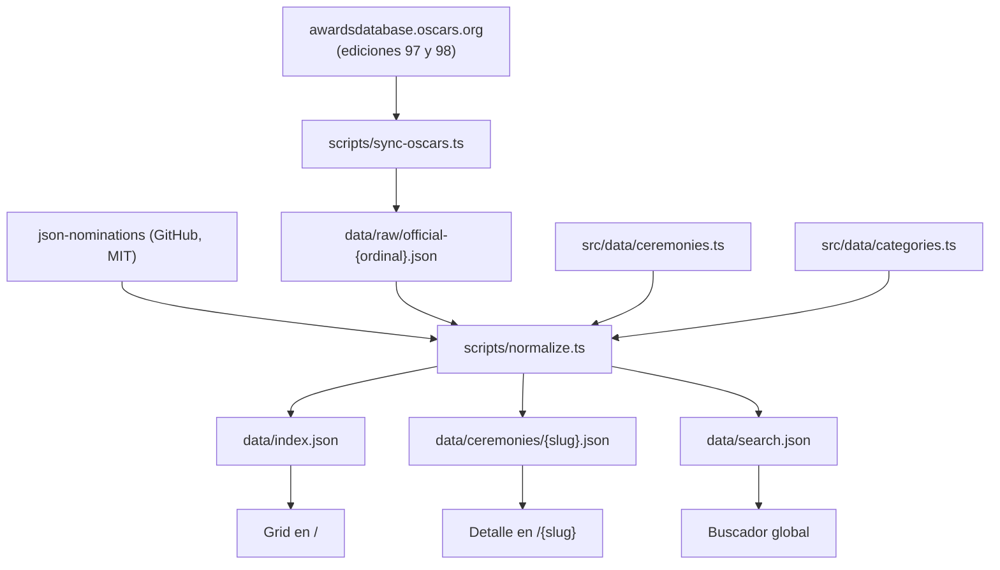

# Oscars Winners — Especificación técnica

Documento listo para desarrollo. Consolida las decisiones de producto, la arquitectura, el manejo de datos, el manejo de errores y el plan de pruebas.

- **Estado**: MVP y buscador implementados. Pendiente la fase de imágenes y pulido visual (ver [15. Estado actual](#15-estado-actual-del-repositorio)).
- **Última actualización**: 16 de septiembre de 2026.

---

## 1. Objetivo y alcance

### 1.1 Problema

Consultar quién ganó los Oscars de un año determinado hoy requiere preguntarle a una IA año por año, buscar en Google o navegar la web oficial con varios clicks. No existe una vista única, rápida y confiable de toda la historia.

### 1.2 Objetivo

Una sola pantalla desde la que cualquier persona llegue a los ganadores de cualquier edición **en dos clicks**, con los nominados disponibles pero deliberadamente en segundo plano.

### 1.3 Alcance

**Dentro del alcance:**

- Exclusivamente los Academy Awards. No Emmys, Globos de Oro ni ningún otro premio.
- Las 98 ediciones, desde la 1ª (1929) hasta la 98ª (2026).
- Todas las categorías que existieron en cada edición, incluidas las extintas.
- Todos los nominados de cada categoría, no solo los ganadores.

**Fuera del alcance:**

- Cuentas de usuario, favoritos, comentarios o cualquier función social.
- Páginas de perfil por persona o por película (posible fase 3).
- Predicciones, apuestas o cobertura de nominaciones antes de la ceremonia.
- Cualquier premio que no sea el Oscar.

### 1.4 Criterios de aceptación del producto

| # | Criterio |
|---|---|
| A1 | Desde la carga inicial, ver los ganadores principales de cualquier edición toma como máximo 2 interacciones (hover o tap, y click). |
| A2 | La pantalla principal muestra las 98 ediciones sin pasos intermedios de navegación. |
| A3 | Cada edición tiene una URL propia, compartible e indexable. |
| A4 | El ganador de cada categoría es visualmente dominante; los nominados son legibles pero secundarios. |
| A5 | Los datos de las 98 ediciones son verificables contra la base oficial del Academy. |
| A6 | El sitio es utilizable en móvil, donde no existe hover. |

---

## 2. Decisiones cerradas

| Tema | Decisión |
|---|---|
| Alcance de datos | 98 ediciones, todas las categorías de cada época, todos los nominados |
| Arquitectura | Sitio 100% estático, JSON pre-generado en build, sin base de datos ni backend |
| Stack | Next.js 15 (App Router), TypeScript, Tailwind v4, Motion |
| Hosting | Vercel |
| Etiqueta de año | Año de la **ceremonia** en grande; edición y año de películas en letra chica |
| Idioma de la UI | Solo inglés |
| Nombres de categoría | Fieles a la época (ver [5.3](#53-etiquetas-por-época)) |
| Estética | Art Déco, negro profundo y dorado metálico, serif display de alto contraste |
| Geometría de superficies | Esquinas redondeadas y relieve con sombra; no recuadros de ángulo recto y 1 px plano (ver [8.5](#85-relieve-radio-y-profundidad)) |
| Emblema | Marca Art Déco **original** (trofeo estilizado, laurel y sunburst). Nunca la estatuilla del Oscar ni su silueta (ver [8.6](#86-emblema)) |
| Hover | Rotación secuencial de los 4 ganadores clave, sobre un telón animado de destellos |
| Pósters | Solo Mejor Película, descargados a mano y committeados, nunca en runtime ni en build |
| Retratos | Solo ganadores de Dirección y de las 4 categorías de actuación, con identidad verificada por crédito |
| Actualización anual | Comando CLI manual con diff previo a commit |
| Fuente de datos | Híbrida: base histórica en JSON + scraper oficial del Academy |

### 2.1 Justificación de las decisiones no obvias

**Por qué estático y no base de datos.** Los datos son de solo lectura, cambian una vez al año y pesan menos de 3 MB. Una base de datos agregaría un servidor que mantener y latencia en cada consulta, justo lo contrario del objetivo. El costo de hosting baja a cero y la latencia queda limitada al CDN.

**Por qué el año de ceremonia y no el de las películas.** La gente busca "ganadores Oscars 2026", no "ganadores de las películas de 2025". La convención oficial del Academy es la contraria, así que el año de películas se muestra siempre como subtítulo para evitar ambigüedad.

**Por qué no generar los datos con IA.** Son ~12.000 registros. A esa escala el riesgo de datos inventados es inaceptable para un producto cuya única propuesta de valor es la confiabilidad.

**Por qué no hay drill-down por década.** Añadiría un click a la ruta crítica, rompiendo el criterio A1.

**Por qué un emblema propio y no la estatuilla.** La estatuilla no existe en ninguna versión libre de derechos, así que no hay una decisión de gusto que tomar aquí. AMPAS registró su copyright en 1941 y además la tiene como marca figurativa, y en *Creative House Promotions v. AMPAS* (9º Circuito, 1994) los tribunales confirmaron que la distribución temprana sin aviso de copyright fue publicación limitada y no la echó al dominio público. Los SVG que circulan como "free" en bancos de iconos son subidas infractoras: descargarlos no transfiere ningún derecho. La salida es un emblema original que comunique "premio" con el vocabulario Art Déco, que sí es de dominio público.

**Por qué las imágenes se limitan a pósters y a cinco retratos por edición.** Cada imagen es un archivo committeado que pesa en el repo y en el presupuesto Lighthouse. Las de Mejor Película y las de los cinco ganadores con nombre propio son las que el usuario reconoce; el resto son técnicos cuya foto no aporta y multiplicaría el peso por diez.

---

## 3. Arquitectura

### 3.1 Flujo de datos



El punto clave es que todo lo de arriba de `normalize.ts` ocurre **fuera del ciclo de vida del sitio**. La aplicación solo consume los tres JSON generados, que están versionados en el repositorio.

### 3.2 Por qué los datos generados se commitean

Los artefactos en `data/` se versionan en git a propósito, por tres razones:

1. El build no depende de que GitHub ni el sitio del Academy estén disponibles.
2. Todo cambio en los datos aparece como un diff revisable en un PR.
3. Hace el build reproducible: el mismo commit produce siempre el mismo sitio.

### 3.3 Estructura de directorios

```
oscars/
├── data/                          # Artefactos generados, versionados
│   ├── index.json                 # Datos del grid (ligero)
│   ├── search.json                # Índice de búsqueda
│   ├── ceremonies/{slug}.json     # 98 archivos de detalle
│   ├── people.json                # Nombre → persona de TMDB, editable a mano
│   ├── films.json                 # Título → película de TMDB, editable a mano
│   └── raw/official-{n}.json      # Salida cruda normalizada del scraper
├── scripts/
│   ├── lib/
│   │   ├── cache.ts               # Descarga con caché en .cache/
│   │   └── parse-official.ts      # Parser cheerio de la base oficial
│   ├── normalize.ts               # Build principal de datos
│   ├── sync-oscars.ts             # CLI de actualización anual
│   └── fetch-images.ts            # Pósters y retratos desde TMDB
├── src/
│   ├── app/
│   │   ├── layout.tsx
│   │   ├── page.tsx               # Grid
│   │   ├── [slug]/page.tsx        # Detalle por edición
│   │   ├── not-found.tsx
│   │   ├── sitemap.ts
│   │   └── globals.css            # Tokens de diseño
│   ├── components/
│   │   └── deco/                  # DecoFrame, RayDivider, Emblem, HoverBackdrop
│   ├── data/
│   │   ├── ceremonies.ts          # Tabla curada de 98 ediciones
│   │   └── categories.ts          # Diccionario canónico
│   └── lib/
│       ├── types.ts
│       └── ceremony-data.ts       # Acceso a los JSON generados
├── public/images/
│   ├── posters/{tmdbId}.webp
│   └── people/{tmdbId}.webp
└── spec.md
```

### 3.4 Scripts de npm

| Comando | Función |
|---|---|
| `npm run dev` | Servidor de desarrollo |
| `npm run build` | `data:check` y luego `next build` |
| `npm run data:build` | Regenera todo `data/` desde las fuentes |
| `npm run data:check` | Valida `data/` sin reescribirlo; falla el build si hay problemas |
| `npm run sync:oscars -- <ordinal>` | Trae una edición desde la base oficial y muestra el diff |
| `npm run images` | Descarga los pósters y retratos faltantes desde TMDB |
| `npm run test` | Pruebas unitarias y de integridad de datos |
| `npm run test:e2e` | Pruebas end-to-end |

`npm run build` **no** descarga nada de la red. Solo valida y compila.

---

## 4. Fuentes de datos

### 4.1 Base histórica

[`delventhalz/json-nominations`](https://github.com/delventhalz/json-nominations), licencia MIT.

Verificado el 16/09/2026: **10.568 registros, 34 categorías distintas, cobertura desde 1927/28 hasta el año de películas 2023**.

```json
{
  "category": "Best Actress",
  "year": "2023",
  "nominees": ["Emma Stone"],
  "movies": [{ "title": "Poor Things", "tmdb_id": 792307, "imdb_id": "tt14230458" }],
  "won": true
}
```

`year` es el **año de las películas**, no el de la ceremonia. Se une a la tabla de ceremonias por `filmYearLabel`.

### 4.2 Hallazgos críticos sobre esta fuente

Estos cuatro puntos condicionan todo el pipeline y fueron verificados contra los datos reales:

1. **Le faltan las dos ediciones más recientes.** Termina en el año de películas 2023, es decir la 96ª ceremonia (marzo 2024). No tiene la 97ª ni la 98ª, que son justamente las más buscadas. **La ingesta desde la fuente oficial no es opcional, es parte del MVP.**

2. **Las categorías ya vienen canonicalizadas a nombres modernos**, no históricos. Son 34 nombres para 98 años, en lugar de las ~90 variantes que tiene la base oficial. Simplifica el mapeo pero exige reconstruir las etiquetas de época.

3. **Los buckets "(Color)" absorbieron las categorías unificadas.** `Best Cinematography (Color)` abarca 1936-2023 aunque la división Color/Blanco y Negro terminó en 1967. Sin corrección, el sitio mostraría "Best Costume Design (Color)" en 2023, que es falso.

4. **No incluye premios honorarios ni especiales** (Honorary Award, Irving G. Thalberg, Jean Hersholt, Special Achievement). El grupo `special` quedará vacío salvo que se decida traerlos de la fuente oficial.

### 4.3 Fuente oficial

`awardsdatabase.oscars.org`. Es la fuente de verdad y no tiene API pública. Se consulta vía un endpoint que devuelve HTML:

```
GET https://awardsdatabase.oscars.org/search/getresults
    ?query={"AwardShowNumberFrom":98,"AwardShowNumberTo":98,"Sort":"3-Award Category-Chron","Search":30}
```

Notas de implementación:

- Se parsea con `cheerio`.
- Los resultados vienen agrupados por categoría en orden cronológico; el ganador se marca con un icono de estatuilla, que en el HTML es una clase CSS. **Esa clase es el punto más frágil del scraper y debe estar aislada en una sola constante de `parse-official.ts`.**
- El orden nombre/película se invierte según la categoría: en las de actuación viene la persona primero y la película después; en otras al revés. El parser necesita esa lógica por categoría.
- Requiere `user-agent` identificable y descarga cacheada en `.cache/`. Una petición por edición, nunca en build.

### 4.4 Fallback

El CSV de Kaggle `unanimad/the-oscar-award` ya cubre 1927-2026 y sirve para desbloquear el MVP si el scraper se complica. Requiere descarga manual con cuenta de Kaggle. Si se usa, debe quedar registrado en el repo de dónde salió cada edición.

### 4.5 Imágenes: pósters y retratos

Todas las imágenes vienen de TMDB, se descargan **una vez en desarrollo** con `npm run images`, se committean, y la API key vive en `.env.local` usada **solo por ese script**, nunca en el runtime del sitio ni en el build.

| Tipo | Alcance | Resolución de origen | Destino |
|---|---|---|---|
| Póster | Ganador de Mejor Película de cada edición (98) | TMDB `w342` | `public/images/posters/{tmdbId}.webp` |
| Retrato | Ganadores de Dirección, Actor, Actriz, Actor y Actriz de Reparto (≤5 por edición, ≤490) | TMDB `w185`, reescalado a 132 px de ancho | `public/images/people/{tmdbId}.webp` |

**Los pósters son fáciles y los retratos no.** La base histórica trae `tmdb_id` de películas, nunca de personas, así que un retrato exige resolver un nombre a una persona de TMDB. Hacerlo a ciegas con `/search/person` confundiría homónimos, y una foto equivocada junto a un ganador es exactamente el tipo de error que el producto no puede permitirse. El procedimiento es:

1. Buscar el nombre en `/search/person`.
2. Desambiguar exigiendo que el candidato aparezca en los créditos de la película con la que ganó (`/movie/{tmdbId}/credits`). Sin coincidencia de crédito, no hay retrato.
3. Escribir el par resuelto en `data/people.json`, **committeado y revisable a mano**, con el nombre, el id de TMDB, la película que sirvió de prueba y la confianza.
4. En adelante el script lee ese archivo y no vuelve a buscar. Un nombre ya resuelto nunca se re-resuelve en silencio.

Cuando las fuentes escriben a una misma persona de dos maneras («Alejandro G.» y «Alejandro Gonzalez»), se conservan las dos filas y la variante declara `aliasOf` apuntando al nombre canónico. Un id repetido **sin** `aliasOf` sigue siendo un error: significa que la desambiguación le dio la misma persona a dos nombres distintos.

**Las ediciones de la fuente oficial no traen ningún id de película**, porque el HTML de la Academia solo publica títulos. Sin id no hay póster que descargar ni lista de créditos con la que probar un retrato, así que una edición sin resolver pierde *todas* sus imágenes a la vez. Por eso `npm run images` resuelve primero los títulos que necesita —el ganador de Mejor Película y las películas de los ganadores de dirección y actuación— con `/search/movie`, aceptando un resultado solo si el título coincide exacto (ignorando mayúsculas, acentos y puntuación) y el año de estreno es el año de la película o el siguiente. El par resuelto se escribe en `data/films.json`. Si sobrevive más de un candidato no se escribe nada y el script los imprime con su fecha de estreno y su número de votos, que es lo que hace falta para decidir a mano.

`data/people.json` y `data/films.json` son los únicos artefactos de datos que admiten corrección manual, y por eso `normalize.ts` los respeta en lugar de regenerarlos.

**Presupuesto de peso:** `public/images/` completo no debe pasar de 4 MB. `data:check` lo verifica y falla si se excede, porque el crecimiento de imágenes es silencioso y se paga en cada visita.

**Cobertura esperada, no excepcional:** las ediciones antiguas casi no tienen retratos en TMDB, y en cualquier edición un nombre puede quedarse sin resolver. La ausencia de imagen es el caso normal, no el borde: el fallback tipográfico de [10.3](#103-en-runtime) es parte del diseño, no una red de seguridad. Lo que **sí** es un defecto es una edición entera sin imágenes por un título sin id: `data:check` avisa cuando el ganador de Mejor Película no tiene `tmdbId`.

### 4.6 Nota legal

"Oscars", "Academy Awards" y la silueta de la estatuilla son marcas registradas de AMPAS, que las defiende activamente.

- El dominio no debe ser confundible con uno oficial. `oscarsawards.com` es un riesgo real; conviene algo descriptivo y distinto.
- El diseño **no debe usar la estatuilla ni su silueta**, ni una imitación reconocible. Está protegida por copyright y como marca figurativa, y no existe una versión libre (ver [2.1](#21-justificación-de-las-decisiones-no-obvias)). En su lugar se usa el emblema original de [8.6](#86-emblema), cuyas reglas de distinción son verificables y de cumplimiento obligatorio.
- Las imágenes de TMDB son material publicitario de terceros. Se usan de forma editorial, acompañando un dato factual, nunca como reclamo ni sugiriendo que la persona avala el sitio.
- El footer debe llevar un disclaimer de sitio no oficial y atribución a las fuentes de datos, incluido el crédito a TMDB que su licencia exige: "This product uses the TMDB API but is not endorsed or certified by TMDB".

---

## 5. Modelo de datos

### 5.1 Tipos

Definidos en `src/lib/types.ts` y compartidos entre los scripts y la aplicación.

```ts
type Ceremony = {
  ordinal: number;        // 1..98
  ceremonyYear: number;   // 2026
  ceremonyDate: string;   // "2026-03-15"
  filmYearLabel: string;  // "2025" | "1927/28"
  slug: string;           // "2026" | "1930-2nd"
  decade: string;         // "2020s"
};

type Movie = {
  title: string; tmdbId?: number; imdbId?: string;
  posterPath?: string;   // solo el ganador de Mejor Película
};

type Entry = {
  names: string[]; movies: Movie[];
  portraitPath?: string; // solo ganadores de dirección y actuación
};

// data/people.json: resolución nombre → persona de TMDB, editable a mano
type PersonLink = {
  name: string;          // tal como aparece en los datos
  tmdbId: number | null; // null = buscado y no resuelto; no se reintenta
  provenBy: string;      // película cuyo crédito confirmó la identidad
  aliasOf?: string;      // esta fila es otra grafía del nombre canónico
};

// data/films.json: resolución título → película de TMDB, editable a mano.
// Solo hace falta para las ediciones de la fuente oficial, que no traen ids.
type FilmLink = {
  title: string;         // tal como lo publicó la Academia
  filmYear: number;      // desambigua títulos reutilizados entre décadas
  tmdbId: number | null; // null = buscado y no resuelto; no se reintenta
  provenBy: string;      // título y fecha de estreno que confirmaron la película
};

type CeremonyCategory = {
  id: string;        // "best-picture"
  label: string;     // etiqueta de la época
  winners: Entry[];  // array: hubo empates
  nominees: Entry[]; // solo los que no ganaron
};

type CeremonyDetail = {
  ceremony: Ceremony;
  groups: { id: CategoryGroup; label: string; categories: CeremonyCategory[] }[];
};

type GridEntry = {
  slug: string; label: string; subtitle: string;
  decade: string; ordinal: number;
  headline: { category: string; winner: string; movie?: string }[];
  posterPath?: string;
};
```

`winners` y `names` son arrays por razones de datos reales, no por sobreingeniería: hubo empates en varias categorías y hay nominaciones compartidas entre varias personas.

### 5.2 Separación de artefactos

Esta es la decisión de rendimiento central:

| Archivo | Contenido | Tamaño esperado | Cuándo se carga |
|---|---|---|---|
| `data/index.json` | 98 `GridEntry`, solo los 4 ganadores clave | pocos KB | Siempre, con el grid |
| `data/ceremonies/{slug}.json` | Detalle completo de una edición | ~10-40 KB | Solo al abrir esa edición |
| `data/search.json` | Índice de búsqueda | ~300 KB | Diferido, al abrir el buscador |
| `data/people.json` | Resolución nombre → persona de TMDB | ~40 KB | Nunca en runtime; lo leen solo `npm run images` y `normalize.ts` |
| `data/films.json` | Resolución título → película de TMDB | pocos KB | Nunca en runtime; lo leen solo `npm run images` y `normalize.ts` |
| `public/images/**` | Pósters y retratos | ≤ 4 MB en total | Una a una vía `next/image`, solo las visibles |

El grid nunca carga los 2,9 MB completos.

### 5.3 Etiquetas por época

Decisión: las etiquetas deben ser **fieles al nombre que la categoría tenía ese año**. Se implementa como `resolveCategoryLabel(categoryId, filmYear)` en `src/data/categories.ts`, con una tabla de reglas.

Para los años partidos ("1927/28"), `filmYear` es el año final (1928).

| Categoría canónica | Regla por año de películas |
|---|---|
| `best-cinematography` | ≤1966 → "Best Cinematography (Color)"; ≥1967 → "Best Cinematography" |
| `best-cinematography-bw` | "Best Cinematography (Black and White)" |
| `best-production-design` | ≤1966 → "Best Art Direction (Color)"; 1967-2011 → "Best Art Direction"; ≥2012 → "Best Production Design" |
| `best-production-design-bw` | "Best Art Direction (Black and White)" |
| `best-costume-design` | ≤1966 → "Best Costume Design (Color)"; ≥1967 → "Best Costume Design" |
| `best-costume-design-bw` | "Best Costume Design (Black and White)" |
| `best-international-feature` | ≤2018 → "Best Foreign Language Film"; ≥2019 → "Best International Feature Film" |
| `best-makeup-hairstyling` | ≤2011 → "Best Makeup"; ≥2012 → "Best Makeup and Hairstyling" |
| `best-visual-effects` | ≤1962 → "Best Special Effects"; ≥1963 → "Best Visual Effects" |
| `best-sound` | ≤1957 → "Best Sound Recording"; 1958-2007 → "Best Sound"; 2008-2019 → "Best Sound Mixing"; ≥2020 → "Best Sound" |
| `best-sound-editing` | ≤1976 → "Best Sound Effects"; 1977-1999 → "Best Sound Effects Editing"; ≥2000 → "Best Sound Editing" |
| `best-documentary-feature` | ≤2021 → "Best Documentary Feature"; ≥2022 → "Best Documentary Feature Film" |
| `best-live-action-short` | ≤1956 → "Best Live Action Short Film (One Reel)"; ≥1957 → "Best Live Action Short Film" |
| `best-live-action-short-two-reel` | "Best Live Action Short Film (Two-Reel)" |
| `best-score-musical-adaptation` | "Best Score (Musical or Adaptation)" |

> **Tarea de verificación obligatoria.** Los años de corte de esta tabla provienen de conocimiento general y **deben confirmarse uno por uno contra `awardsdatabase.oscars.org`** antes de publicar. Cualquier discrepancia se corrige en esta tabla, no en el código que la consume.

**Dos excepciones deliberadas**, donde se prioriza que el usuario encuentre lo que busca sobre la fidelidad histórica:

- `best-picture` se muestra siempre como "Best Picture", aunque en distintas épocas se llamó "Outstanding Picture", "Outstanding Production" y "Best Motion Picture".
- Las categorías de actuación se muestran como "Best Actor" / "Best Supporting Actress", no con el nombre oficial "Actor in a Leading Role".

Ambas quedan documentadas en un comentario en `categories.ts`.

### 5.4 Diccionario canónico de categorías

`src/data/categories.ts` mapea cada nombre de entrada a un id canónico, un grupo y un orden. Cada categoría declara `aliases` normalizados que cubren **tanto** los nombres del dataset histórico **como** los de la base oficial (`ACTOR IN A LEADING ROLE`, `MUSIC (ORIGINAL SCORE)`, `WRITING (ADAPTED SCREENPLAY)`, etc.).

Normalización de alias: mayúsculas, espacios colapsados, puntuación eliminada.

| Grupo | Etiqueta en UI | Categorías canónicas (en orden) |
|---|---|---|
| `headline` | The Big Two | `best-picture`, `best-director` |
| `acting` | Acting | `best-actor`, `best-actress`, `best-supporting-actor`, `best-supporting-actress` |
| `writing` | Writing | `best-original-screenplay`, `best-adapted-screenplay`, `best-original-story` |
| `feature` | Features | `best-animated-feature`, `best-international-feature`, `best-documentary-feature` |
| `craft` | Crafts | `best-cinematography`, `best-cinematography-bw`, `best-film-editing`, `best-production-design`, `best-production-design-bw`, `best-costume-design`, `best-costume-design-bw`, `best-makeup-hairstyling`, `best-visual-effects`, `best-sound`, `best-sound-editing`, `best-casting` |
| `music` | Music | `best-original-score`, `best-score-musical-adaptation`, `best-original-song` |
| `shorts` | Short Films | `best-animated-short`, `best-live-action-short`, `best-live-action-short-two-reel`, `best-live-action-short-color`, `best-documentary-short` |
| `retired` | Retired Categories | `best-assistant-director`, `best-dance-direction`, `unique-artistic-production` |
| `special` | Special Awards | vacío por ahora |

Total: 35 ids canónicos (los 34 del dataset más `best-casting`, nueva en la 98ª edición).

**Criterio de agrupación:** los grupos reflejan la *naturaleza* de la categoría, no si está extinta. Por eso `best-cinematography-bw` vive en `craft` y no en `retired`: en la vista de 1960 tiene que aparecer junto a la versión en color. `retired` se reserva para categorías sin equivalente moderno alguno.

### 5.5 Casos borde de datos

Todos deben tener una prueba asociada.

| Caso | Manejo |
|---|---|
| 1930 tuvo dos ceremonias (2ª en abril, 3ª en noviembre) | Ambas reciben slug sufijado: `1930-2nd` y `1930-3rd`. Ninguna ocupa el `/1930` a secas |
| No hubo ceremonia en 1933 | La tabla es una lista de fechas reales, así que 1933 simplemente no existe |
| Las 6 primeras ediciones honran años partidos | Solo afecta `filmYearLabel` ("1927/28") |
| La 1ª edición es la única de los años 20 | El grid tendrá un grupo "1920s" con un solo recuadro. Aceptado |
| Empates con varios ganadores | `winners` es un array y la UI los renderiza todos |
| Nominaciones compartidas entre personas | `Entry.names` es un array |
| Una nominación por varias películas | `Entry.movies` es un array |
| Una nominación sin película (un caso, un programa de TV) | `movies` vacío debe renderizar sin romper |
| Categorías que solo existieron 2-5 años | Se muestran normalmente en las ediciones que corresponde |
| Categoría nueva no vista antes | El build **falla** con el nombre exacto sin mapear |

---

## 6. Pantalla principal (`/`)

- Grid responsive con las 98 ediciones, de la más reciente a la más antigua.
- Separadores **sticky por década** ("2020s", "2010s"...).
- Navegación de décadas persistente: barra superior en desktop, chips con scroll horizontal en móvil. Hace scroll suave dentro de la misma página, sin navegar.
- Cada recuadro es un `<Link href="/{slug}">`, no un botón. Así es rastreable por buscadores, permite abrir en pestaña nueva y funciona con el botón atrás.
- Cabecera sobria con el nombre del sitio y el buscador. Footer con disclaimer y atribuciones.

### 6.1 Anatomía del recuadro

En reposo: el año de la ceremonia en grande, y debajo en letra chica "98th Ceremony — Films of 2025".

En hover: rotan secuencialmente con fade y desplazamiento los 4 ganadores clave, en este orden fijo: **Mejor Película, Director, Actor, Actriz**. Cada uno visible ~1,6 s.

El recuadro se eleva: sube 2 px, la sombra crece y el filo dorado se aclara ([8.5](#85-relieve-radio-y-profundidad)).

#### 6.1.1 Telón animado del hover

El fondo del recuadro no se queda quieto mientras rotan los ganadores. Se compone de tres capas, todas detrás del texto y con `pointer-events: none`:

1. **Viñeta dorada** que aparece con fade desde la esquina superior, como la luz cálida de un foco.
2. **Destellos de flash**: de 5 a 7 estrellas Art Déco de cuatro puntas que florecen y se apagan de forma escalonada, sugiriendo los flashes de la prensa en la alfombra roja. Opacidad máxima 0,35.
3. **Póster de Mejor Película** al 8 % de opacidad, cuando esa edición tiene póster. Es la capa que hace que cada recuadro se sienta distinto en lugar de todos iguales.

Restricciones, con el mismo peso que las de [6.2](#62-restricciones-de-implementación-del-hover):

- **Las posiciones de los destellos son deterministas**, derivadas de un hash del slug. No se usa `Math.random()`: produciría posiciones distintas en servidor y cliente, es decir un error de hidratación, y haría imposible probar el componente.
- **El telón no añade ni un temporizador de JavaScript.** Se anima con CSS, activado por la clase que ya marca la tarjeta con hover. El único temporizador del sistema sigue siendo el de la rotación de ganadores.
- Solo se animan `opacity` y `transform`, para que el trabajo quede en el compositor y no provoque layout.
- Con `prefers-reduced-motion: reduce` no hay destellos ni viñeta animada: queda el fondo estático.
- **El telón nunca compromete la legibilidad.** El texto sobre él mantiene contraste AA, lo que se audita explícitamente en el estado de hover y no solo en reposo.

### 6.2 Restricciones de implementación del hover

Son requisitos, no sugerencias:

1. **Solo la tarjeta con hover monta su temporizador.** Con 98 recuadros, montar un intervalo por tarjeta degrada el rendimiento y agota la batería. El temporizador se crea en `mouseenter` y se destruye en `mouseleave`.
2. Al salir el mouse, la tarjeta vuelve al estado de reposo y la rotación se reinicia desde Mejor Película.
3. Con `prefers-reduced-motion: reduce` no hay rotación: se muestran los 4 ganadores estáticos.
4. Las ediciones antiguas pueden no tener las 4 categorías (Actor de Reparto no existe antes de 1936). La rotación usa solo las disponibles y **nunca muestra un hueco vacío**.

---

## 7. Detalle por edición (`/{slug}`)

Ruta prerenderizada con `generateStaticParams()` sobre los 98 slugs. Se presenta como overlay sobre el grid, de modo que es simultáneamente un modal navegable y una página compartible e indexable.

### 7.1 Contenido

- Cabecera: año de ceremonia, número de edición, año de películas, fecha exacta y póster de Mejor Película.
- Categorías agrupadas según [5.4](#54-diccionario-canónico-de-categorías), empezando por el bloque destacado.
- Por categoría: **ganador en tipografía dorada y dominante**; nominados debajo, en gris, tamaño reducido, sin competir por la atención.
- **Retrato del ganador** junto al nombre, en las categorías de dirección y actuación: miniatura de 56 px, recorte cuadrado de esquinas redondeadas, marco dorado de 1 px. Va a la izquierda del nombre y comparte su línea base, para que el ojo siga leyendo nombres en columna y la foto acompañe sin desviar la lectura.
- Índice sticky de grupos al costado en desktop.

Reglas de las imágenes en esta vista:

- Son **decorativas respecto al dato**: el nombre del ganador nunca depende de que la imagen cargue, y el `alt` no repite el nombre que ya está escrito al lado.
- Sin imagen, el hueco se rellena con un **monograma tipográfico**: las iniciales en Playfair sobre el mismo marco redondeado. La caja mide siempre lo mismo, con o sin foto, así que el layout no salta ni provoca CLS.
- Se cargan con `next/image` en tamaño fijo y `loading="lazy"` salvo las del bloque destacado, que entran en la primera pantalla.

### 7.2 Interacción

| Acción | Resultado |
|---|---|
| Flechas de anterior/siguiente | Navega de edición sin cerrar el overlay |
| `←` / `→` | Igual que las flechas |
| `Esc` | Cierra y vuelve al grid |
| Click fuera del contenido | Cierra |
| Entrada directa por URL | Renderiza la página completa; cerrar lleva a `/` |

En los extremos (1ª y 98ª edición) la flecha correspondiente se deshabilita, no se oculta, para que el layout no salte.

#### Colocación de las flechas

Las flechas son **cromo del overlay, no contenido**, y su colocación lo refleja:

- Una a cada lado: anterior a la izquierda, siguiente a la derecha. Centradas verticalmente.
- **Fuera del panel de contenido**, sobre el fondo oscurecido, no dentro del área que hace scroll. Así no se mezclan con la información de la edición ni se van con el scroll.
- Discretas: 40 px de diámetro, circulares, fondo translúcido con desenfoque y filo dorado de 1 px. Deliberadamente más pequeñas que cualquier elemento de la jerarquía de contenido.
- Son hermanas del panel dentro del `role="dialog"`, de modo que siguen dentro de la trampa de foco.
- En móvil no hay margen laterales donde ponerlas: por debajo de `md` se recogen en la cabecera del overlay, y el swipe de [7.3](#73-móvil) sigue siendo el gesto principal.

> **Regla de CSS que esto impone.** Las utilidades de posición de Tailwind (`fixed`, `absolute`) deben poder ganarle a las clases propias de `globals.css`. Hoy no pueden: `.deco-frame` declara `position: relative` sin capa, y el CSS sin capa siempre vence al de `@layer utilities`, así que las dos flechas terminan apiladas a la izquierda. Las clases propias van en `@layer components`.

Requisitos de accesibilidad del overlay: foco atrapado mientras está abierto, foco devuelto a la tarjeta de origen al cerrar, `aria-modal` y scroll del fondo bloqueado.

### 7.3 Móvil

Overlay a pantalla completa, índice de grupos colapsado en un desplegable, y navegación entre ediciones también por swipe además de las flechas.

### 7.4 Densidad de la primera pantalla

El problema: la cabecera ocupa casi todo el alto útil, así que el primer click deja al usuario mirando un año gigante y nada de lo que vino a ver. El contenido es el correcto; está mal acomodado.

Objetivo medible: **en un viewport de 1440 × 900, al abrir una edición se ve la cabecera completa, el bloque destacado entero y al menos la primera categoría de actuación, sin hacer scroll.** En 390 × 844 se ve la cabecera y el ganador de Mejor Película.

Cómo se consigue, en orden de impacto:

1. **Dos columnas de categorías desde `lg`.** Duplica lo visible por pantalla y es el único cambio que aporta un salto de verdad. Las categorías fluyen en columnas dentro de cada grupo, sin partir un bloque entre columnas.
2. **Escala tipográfica reducida en el overlay**: el año baja de `text-6xl`/`text-8xl` a `text-4xl`/`text-5xl`, el ganador de `text-3xl` a `text-xl`/`text-2xl`, y los nominados a `0.8125rem`.
3. **Ritmo vertical más apretado**: menos margen entre categorías, entre grupos y bajo la cabecera.
4. **Cabecera compacta**: los metadatos de la edición (año de películas y fecha) van en una sola línea en lugar de apiladas, junto al póster.

Dos límites que no se negocian al comprimir:

- **La jerarquía se mantiene.** Reducir el ganador a `text-xl` solo es válido si sigue dominando visualmente sobre un nominado de `0.8125rem`. La distinción no puede quedar solo en el color ([8.4](#84-accesibilidad)).
- **El contraste se vuelve a auditar.** Texto más pequeño no puede apoyarse en la excepción de tamaño grande de WCAG: `--color-muted` debe seguir cumpliendo 4.5:1 en su nuevo tamaño.

---

## 8. Sistema de diseño

### 8.1 Tokens

Definidos como variables CSS en `src/app/globals.css`.

| Token | Valor | Uso |
|---|---|---|
| `--color-ink` | `#0A0908` | Fondo base |
| `--color-surface` | `#141210` | Recuadros y overlay |
| `--color-gold` | `#C9A227` | Acento principal, años |
| `--color-gold-light` | `#E8C96A` | Ganadores, estados hover |
| `--color-muted` | `#B8A990` | Nominados. **Debe cumplir contraste AA (≥4.5:1) sobre `--color-surface`** |
| `--radius-card` | `14px` | Recuadros del grid |
| `--radius-panel` | `20px` | Panel del overlay y contenedores grandes |
| `--radius-inner` | `8px` | Filete interior del marco, miniaturas |
| `--radius-pill` | `999px` | Chips de década y flechas circulares |
| `--surface-raised` | degradado 160° de `#191612` a `#0F0D0B` | Cara del recuadro, da el bisel |
| `--shadow-raised` | sombra base más filo claro superior interior | Reposo de las superficies elevadas |
| `--shadow-lifted` | sombra más amplia más halo dorado tenue | Hover y foco de esas superficies |

### 8.2 Tipografía

Vía `next/font`, con `display: swap` y subsetting.

- **Playfair Display**: años, nombres de ganadores, títulos. Serif de alto contraste, coherente con la época.
- **Inter**: elementos de interfaz, nominados, metadatos.

### 8.3 Motivos Art Déco

Marcos geométricos de 1 px con filete interior, separadores de década con motivo de rayos, estrellas de cuatro puntas, laurel, sunburst y una textura de grano muy sutil. Todo con CSS o SVG inline; sin imágenes de fondo pesadas. **Sin la estatuilla ni su silueta** (ver [4.6](#46-nota-legal)).

Los **esquineros escalonados** del marco original son incompatibles con las esquinas redondeadas de [8.5](#85-relieve-radio-y-profundidad) y se retiran. Su papel de acento lo asumen cuatro rombos dorados diminutos en las diagonales del marco.

### 8.4 Accesibilidad

- Contraste AA en todo el texto. El punto de fallo típico de esta paleta son los nominados en gris sobre negro, así que ese valor se audita explícitamente.
- Foco visible y con estilo propio en todos los elementos interactivos.
- Toda la navegación operable por teclado.
- `prefers-reduced-motion` respetado en las animaciones del grid y del overlay.
- La información nunca se transmite solo por color: el ganador se distingue también por tamaño y jerarquía, no únicamente por ser dorado.

### 8.5 Relieve, radio y profundidad

La primera versión trató el Art Déco como geometría plana: bordes de 1 px y ángulos rectos. El resultado se lee como una tabla, no como un objeto. La corrección es que las superficies se sientan **piezas físicas apoyadas sobre el fondo**, sin abandonar el vocabulario de la época.

Las reglas:

| Aspecto | Regla |
|---|---|
| Radio | Ninguna superficie de contenido tiene ángulo recto. `--radius-card` en los recuadros, `--radius-panel` en el overlay, `--radius-pill` en chips y flechas |
| Cara | Degradado sutil (`--surface-raised`), no color plano: es lo que crea la sensación de bisel |
| Filo | Línea clara de 1 px en el borde superior interior y línea oscura en el inferior. El truco de relieve más barato que existe |
| Sombra | `--shadow-raised` en reposo, `--shadow-lifted` en hover y foco. Difusa y desplazada hacia abajo, nunca un contorno duro |
| Marco | El doble filete dorado se conserva, ahora concéntrico al radio: el interior usa `--radius-inner` |
| Movimiento | El hover eleva 2 px con `transform`. Nada de animar `box-shadow` ni `width` |

Se implementa reescribiendo `DecoFrame`, que ya envuelve cada recuadro, con dos variantes: `raised` (grid, overlay, tarjetas) y `flat` (contenedores internos que no deben competir). **El componente es uno solo**: el relieve no se reimplementa clase por clase en cada pantalla.

Tres cosas que este cambio debe respetar:

1. **Las clases propias van en `@layer components`.** Hoy están sin capa y por eso le ganan a las utilidades de Tailwind, con la consecuencia visible de las flechas de [7.2](#72-interacción).
2. **El foco sigue siendo visible sobre el relieve.** Un anillo dorado sobre un halo dorado se pierde; el foco debe distinguirse del estado hover.
3. **La sombra no puede matar el rendimiento.** Con 98 recuadros en pantalla, sombras enormes y desenfoques a gran escala cuestan pintado. El presupuesto Lighthouse de [11.6](#116-rendimiento-y-accesibilidad) es el juez.

### 8.6 Emblema

Un único SVG inline, `src/components/deco/Emblem.tsx`: trofeo Art Déco estilizado sobre plinto escalonado, con media corona de laurel y rayos de sunburst. Dorado, monocromo, legible desde 16 px hasta 96 px.

**Reglas de distinción, de cumplimiento obligatorio** ([4.6](#46-nota-legal)). El emblema no puede tener:

- figura humana, ni desnuda ni estilizada;
- espada, brazos cruzados ni postura frontal rígida;
- base cilíndrica con carrete de película de cinco radios;
- las proporciones de la estatuilla (figura alargada de pie sobre base estrecha).

Lo que sí es: una copa o forma geométrica cerrada sobre un plinto escalonado. Si en una revisión alguien la confunde con la estatuilla, el diseño está mal y se corrige, no se defiende.

Dónde aparece: lockup de la cabecera junto al nombre del sitio, centro de los separadores de década, marca de 12 px antes del ganador en el bloque destacado, cabecera del overlay, footer, página de no encontrado, favicon e imagen social. Nunca de un tamaño o posición que sugiera sello oficial.

### 8.7 Imágenes en la UI

| Uso | Forma | Tamaño |
|---|---|---|
| Póster en la cabecera del overlay | Rectángulo 2:3, `--radius-inner`, marco dorado de 1 px | 144 px de ancho |
| Retrato junto al ganador | Cuadrado recortado, `--radius-inner` | 56 px |
| Póster en el telón del hover | Cubre el recuadro, 8 % de opacidad | Tamaño del recuadro |

- **Una sola pieza de fallback** para todos los casos: el monograma tipográfico de [7.1](#71-contenido), con la misma caja y el mismo radio que la imagen que sustituye.
- Los recortes cuadrados de retratos usan `object-position: top`: un recorte centrado decapita a la gente.
- Toda imagen declara `width` y `height`. Cero desplazamiento de layout.

---

## 9. Búsqueda global

Sobre `data/search.json`, pre-generado y cargado de forma diferida al abrir el buscador.

- Busca por año, título de película y nombre de persona.
- Resultados agrupados por tipo, mostrando la edición a la que pertenecen y si ganó o fue nominado.
- Normaliza acentos y mayúsculas, para que "Amelie" encuentre "Amélie".
- Enter sobre un resultado abre el detalle de esa edición.
- Accesible por teclado con `/` para enfocar, flechas para recorrer y `Esc` para cerrar.

---

## 10. Manejo de errores

La regla general: **los errores de datos se detectan en build y rompen el build; en runtime el sitio no puede fallar** porque solo consume JSON ya validados.

### 10.1 En build

| Situación | Comportamiento |
|---|---|
| Categoría sin mapear en el diccionario | **Falla** el build listando los nombres exactos no reconocidos y en qué ediciones aparecen |
| `year` del dataset que no une con ninguna ceremonia | **Falla** indicando el valor huérfano |
| Una edición queda sin ninguna categoría | **Falla**: indica que la unión se rompió |
| Una edición no tiene ganador de Mejor Película | **Falla**, salvo que esté en una lista explícita de excepciones justificadas |
| Una categoría queda sin ningún ganador | **Advierte** con el detalle, y falla si supera un umbral configurado |
| Validación Zod de los artefactos generados | **Falla** mostrando la ruta exacta del campo inválido |
| Conteo de nominados por edición muy fuera de rango | **Advierte** para revisión manual |
| Póster faltante para un Mejor Película | **Advierte**; la UI usa el monograma tipográfico como fallback |
| `posterPath` o `portraitPath` que apunta a un archivo que no existe | **Falla** con la ruta exacta: una imagen rota es peor que ninguna |
| `public/images/` por encima del presupuesto de 4 MB | **Falla** listando los archivos más pesados |
| `data/people.json` con un nombre mapeado a dos ids de TMDB | **Falla**: la desambiguación quedó corrupta |
| Un id de TMDB compartido por dos nombres sin declarar `aliasOf` | **Falla**: o son dos personas con la misma foto, o falta declarar la variante |
| Ganador de Mejor Película sin `tmdbId` | **Advierte** nombrando la edición: sin id esa edición pierde póster y retratos a la vez |
| Retrato faltante para un ganador de dirección o actuación | **Silencio.** Es el caso esperado en la mayoría de ediciones ([4.5](#45-imágenes-pósters-y-retratos)), y advertir 300 veces entrena a ignorar las advertencias |

El motivo de ser tan estricto es concreto: el único valor del sitio es que los datos sean correctos, así que es preferible un build roto a publicar datos mal agrupados en silencio.

### 10.2 En el scraper

| Situación | Comportamiento |
|---|---|
| Respuesta HTTP no exitosa | Reintenta con backoff exponencial, 3 intentos; luego aborta con el código de estado |
| Cambió el HTML y no se encuentran categorías | Aborta sin escribir nada, e indica que el parser necesita actualizarse |
| No se detecta ningún ganador | Aborta: casi con certeza cambió la clase CSS del icono de estatuilla |
| La edición trae muchas menos categorías de lo esperado | Escribe el archivo pero marca la salida como sospechosa en el diff |
| La edición ya existe en `data/raw/` | Muestra el diff y **exige confirmación explícita** antes de sobrescribir |

El scraper **nunca** escribe directamente los artefactos finales. Escribe `data/raw/official-{ordinal}.json`, y `normalize.ts` es el único que produce `data/`.

### 10.3 En runtime

| Situación | Comportamiento |
|---|---|
| Slug inexistente | `not-found.tsx` con estética propia y enlace de vuelta al grid |
| Slug ambiguo como `/1930` | Redirige a la primera de las dos ediciones de ese año, con un aviso que ofrece la otra |
| Categoría sin nominados además del ganador | Renderiza solo el ganador, sin encabezado de nominados vacío |
| Póster o retrato que no carga | Monograma tipográfico en la misma caja, sin salto de layout |
| Falla la carga diferida del índice de búsqueda | El buscador informa el problema y permite reintentar; el resto del sitio sigue funcionando |
| JavaScript deshabilitado | El grid y las 98 páginas de detalle siguen siendo navegables porque son enlaces y páginas reales. Se pierde solo la animación del hover |

### 10.4 En el script de imágenes

Se ejecuta a mano y nunca en build, así que puede ser conversacional, pero no puede escribir datos dudosos.

| Situación | Comportamiento |
|---|---|
| `TMDB_API_KEY` ausente | Aborta explicando que solo hace falta para este script |
| Película sin id (ediciones de la fuente oficial) | Resuelve el título por `/search/movie` exigiendo título exacto y año de estreno igual al año de la película o el siguiente, antes de descargar nada |
| Varias películas con el mismo título dentro de la ventana de año | **No escribe ningún id.** Imprime cada candidato con su fecha de estreno y sus votos, y lo deja para `data/films.json` |
| Búsqueda de persona sin coincidencia de crédito | **No escribe ningún id.** Registra el nombre con `tmdbId: null` y sigue |
| Varios candidatos con crédito en la misma película | Aborta para ese nombre y lo deja para resolución manual, con los candidatos impresos |
| La persona no tiene foto de perfil en TMDB | Registra el id y omite la descarga. Es el caso normal |
| Descarga fallida o imagen corrupta | Reintenta con backoff, 3 intentos; luego omite esa imagen sin romper el resto |
| La imagen ya existe en disco | La omite. El script es idempotente y reejecutarlo es barato |
| El archivo escrito dejaría `public/images/` sobre el presupuesto | Aborta antes de escribir, no después |

---

## 11. Plan de pruebas

Vitest para unitarias e integridad de datos, Testing Library para componentes, Playwright para end-to-end.

### 11.1 Integridad de datos (prioridad máxima)

Corren en CI y bloquean el merge. Son la red de seguridad del producto.

| # | Prueba |
|---|---|
| D1 | La tabla de ceremonias tiene exactamente 98 entradas |
| D2 | Los `slug` son únicos; los `ordinal` son 1..98 sin huecos |
| D3 | Las fechas de ceremonia son estrictamente crecientes |
| D4 | 1930 produce dos ediciones con slugs distintos y ninguna ocupa `/1930` |
| D5 | No existe ninguna edición en 1933 |
| D6 | Los `filmYearLabel` son únicos y las 6 primeras ediciones usan formato con barra |
| D7 | Existe un archivo de detalle por cada uno de los 98 slugs |
| D8 | Ningún nombre de categoría del dataset queda sin mapear |
| D9 | Todo id canónico usado pertenece a un grupo declarado |
| D10 | Toda categoría de todo detalle tiene al menos un ganador |
| D11 | Ningún nominado aparece simultáneamente en `winners` y `nominees` de la misma categoría |
| D12 | Cada `GridEntry` tiene al menos un ganador destacado |
| D13 | El total de nominaciones en los detalles coincide con el total de registros de entrada |
| D14 | Todos los artefactos pasan la validación Zod |
| D15 | `index.json` se mantiene bajo un presupuesto de tamaño definido |
| D16 | Toda ruta de imagen de todo artefacto corresponde a un archivo real en `public/images/` |
| D17 | `public/images/` se mantiene bajo el presupuesto de 4 MB |
| D18 | `data/people.json` no mapea un nombre a dos ids, ni un id a dos nombres canónicos distintos (una variante declarada con `aliasOf` sí puede compartirlo) |
| D19 | No hay `portraitPath` en categorías fuera de dirección y actuación |
| D20 | `data/films.json` no mapea un mismo título y año de película a dos ids |
| D21 | El ganador de Mejor Película de cada edición resuelve a un id de TMDB |

### 11.2 Verificación puntual contra la fuente oficial

Un conjunto pequeño de aserciones sobre datos conocidos, que detecta desalineaciones de la unión año/ceremonia mejor que cualquier prueba estructural:

| Edición | Verificación |
|---|---|
| 1ª (`1929`) | Mejor Película es "Wings"; existe "Unique and Artistic Production" |
| 3ª (`1930-3rd`) | Es una edición distinta de la 2ª, con ganadores distintos |
| 41ª (1968) | Empate en Mejor Actriz: Katharine Hepburn y Barbra Streisand |
| 92ª (2020) | Mejor Película es "Parasite" y la etiqueta de categoría internacional ya es "International Feature Film" |
| 96ª (2024) | Mejor Película es "Oppenheimer" |
| 98ª (2026) | La edición existe y proviene de la fuente oficial, no de la base histórica |
| 1955 | La categoría de vestuario se etiqueta "(Color)" y "(Black and White)", no unificada |
| 2023 | La categoría de vestuario se etiqueta "Best Costume Design", sin sufijo de color |

La última pareja es la prueba de regresión directa del hallazgo 3 de [4.2](#42-hallazgos-críticos-sobre-esta-fuente).

### 11.3 Unitarias

- `ordinalSuffix`: 1st, 2nd, 3rd, 11th, 21st, 98th.
- `resolveCategoryLabel`: para cada regla de [5.3](#53-etiquetas-por-época), un caso antes del corte, uno en el corte y uno después.
- Normalización de alias: variantes de mayúsculas, espacios y puntuación llegan al mismo id.
- `ceremonyByFilmYear` con años partidos.
- Normalización de texto del buscador con acentos.

### 11.4 Componentes

- El recuadro muestra el año y el subtítulo en reposo.
- El temporizador de rotación se monta en `mouseenter` y **se limpia en `mouseleave`** (regresión de la restricción de rendimiento).
- Con `prefers-reduced-motion` no se monta ningún temporizador.
- Una edición sin las 4 categorías clave rota solo las disponibles, sin huecos.
- El ganador se renderiza con jerarquía distinta a los nominados.
- Una categoría sin nominados no renderiza encabezado vacío.
- Los empates renderizan todos los ganadores.
- Una nominación sin película no rompe el render.

Del pulido visual:

- `DecoFrame` en variante `raised` aplica radio y sombra; en `flat` no aplica sombra.
- El telón del hover **no monta ningún temporizador nuevo**: el conteo de temporizadores vivos con hover es el mismo que sin el telón.
- Las posiciones de los destellos son idénticas entre dos renders del mismo slug, y distintas entre slugs.
- Con `prefers-reduced-motion` no se renderizan destellos.
- El retrato ausente renderiza el monograma con las iniciales correctas, en una caja de las mismas dimensiones que la imagen.
- Un nombre de una sola palabra y uno con tres producen monogramas válidos.
- La flecha de anterior queda a la izquierda del panel y la de siguiente a la derecha, ambas fuera del contenedor con scroll.
- En los extremos la flecha correspondiente está deshabilitada y presente en el DOM.
- El emblema es `aria-hidden` cuando acompaña a un texto que ya dice lo mismo, y tiene nombre accesible cuando va solo.

### 11.5 End-to-end

| # | Escenario |
|---|---|
| E1 | Cargar `/`, hacer hover en un recuadro, ver rotar los ganadores |
| E2 | Click en un recuadro abre el overlay con la URL `/{slug}` |
| E3 | Las flechas navegan entre ediciones y la URL acompaña |
| E4 | `Esc` cierra y devuelve a `/` |
| E5 | El botón atrás del navegador funciona en toda la secuencia |
| E6 | Entrar directo a `/1994` renderiza la página completa |
| E7 | Un slug inválido muestra la página de no encontrado |
| E8 | Saltar por década hace scroll a la sección correcta |
| E9 | Buscar "Parasite" lleva a la edición correcta |
| E10 | En viewport móvil, el tap abre el detalle a pantalla completa |
| E11 | Recorrer grid y overlay solo con teclado |
| E12 | Con JavaScript deshabilitado, el grid y el detalle siguen navegables |
| E13 | En 1440 × 900, abrir una edición muestra cabecera, bloque destacado y la primera categoría de actuación sin scroll ([7.4](#74-densidad-de-la-primera-pantalla)) |
| E14 | La flecha de anterior está a la izquierda y la de siguiente a la derecha, comprobado por sus coordenadas, y ninguna se desplaza al hacer scroll del panel |
| E15 | El póster y los retratos cargan en la 96ª edición, y la 98ª muestra los monogramas de fallback sin error de consola |
| E16 | Navegar entre ediciones con las flechas no produce desplazamiento de layout por las imágenes |

### 11.6 Rendimiento y accesibilidad

- Presupuesto Lighthouse: Rendimiento ≥95, Accesibilidad 100, SEO ≥95, en móvil. Se vuelve a medir **con las imágenes y el relieve activos**, que es cuando el presupuesto corre riesgo real.
- CLS ≤ 0,02 en el grid y en el overlay, la métrica que delata imágenes sin dimensiones.
- Auditoría automatizada de contraste con `axe`, con foco en los nominados en gris: en su tamaño reducido de [7.4](#74-densidad-de-la-primera-pantalla) y **también sobre el telón de hover**, no solo sobre el fondo en reposo.
- Verificar que hacer hover sobre muchos recuadros en secuencia no deja temporizadores vivos.
- Peso total de `public/images/` bajo presupuesto, comprobado en CI y no solo en local.

---

## 12. SEO

- `generateMetadata` por edición, con títulos del tipo "2026 Oscar Winners — 98th Academy Awards".
- Open Graph e imagen social por edición.
- `sitemap.ts` con las 98 rutas más la raíz.
- JSON-LD por edición describiendo el evento y sus premios.
- URLs limpias y estables: el slug es parte del contrato público y **no debe cambiar** una vez publicado.

---

## 13. Fases de entrega

### MVP

1. Diccionario canónico de categorías con las etiquetas por época y su tabla de reglas verificada.
2. `normalize.ts`: une la base histórica con ceremonias y categorías, y falla ante cualquier dato no reconocido.
3. Ingesta de las ediciones 97ª y 98ª desde la fuente oficial. **Bloqueante**: sin esto el sitio no responde la consulta más frecuente.
4. Generación y validación de `data/index.json` y los 98 detalles.
5. Tokens de diseño, tipografías y layout base.
6. Grid con separadores por década y navegación de décadas.
7. Animación de hover con las restricciones de rendimiento de [6.2](#62-restricciones-de-implementación-del-hover).
8. Ruta de detalle con agrupación, navegación y accesibilidad.
9. Adaptación a móvil.
10. SEO, disclaimer legal y auditoría de contraste.

### Fase 2

11. Buscador global.

### Fase 3 — Imágenes y pulido visual

El MVP resolvió el problema de información. Esta fase resuelve el de presentación: el sitio es correcto pero se lee como una hoja de cálculo, y no tiene una sola imagen.

12. Tokens de relieve y radio, y `DecoFrame` reescrito con sus dos variantes ([8.5](#85-relieve-radio-y-profundidad)).
13. Emblema Art Déco original y sus colocaciones ([8.6](#86-emblema)).
14. Telón animado del hover con destellos deterministas ([6.1.1](#611-telón-animado-del-hover)).
15. Flechas del overlay a izquierda y derecha, fuera del panel ([7.2](#72-interacción)).
16. Densidad de la primera pantalla del overlay ([7.4](#74-densidad-de-la-primera-pantalla)).
17. Pipeline de pósters desde TMDB y póster en la cabecera del overlay.
18. Pipeline de retratos con `data/people.json`, retratos junto a los ganadores y monograma de fallback.
19. CLI `sync:oscars` pulido con diff legible, runbook anual y re-auditoría de presupuestos con las imágenes activas.

Los puntos 12 a 16 no tocan los datos y se pueden entregar sin la API key de TMDB. Los puntos 17 y 18 sí la necesitan.

### Ideas para fase 4

Páginas por persona y por película, estadísticas históricas, filtros por categoría a lo largo del tiempo.

---

## 14. Procedimiento de actualización anual

Ejecutado manualmente después de cada ceremonia. La decisión de que sea manual es deliberada: son datos que no admiten errores y merecen revisión humana.

```bash
npm run sync:oscars -- 99    # trae la 99ª desde la base oficial
git diff data/raw/           # revisar la salida cruda
npm run data:build           # regenerar artefactos
npm run test                 # integridad de datos
npm run images               # póster y retratos de los nuevos ganadores
git diff data/               # revisar el diff final
```

Antes de correrlo hay que **añadir la fecha de la nueva ceremonia** a `CEREMONY_DATES` en `src/data/ceremonies.ts`. Es el único dato que se escribe a mano cada año.

Si la ceremonia introduce una categoría nueva, el build fallará a propósito con el nombre exacto sin mapear, que es la señal para añadirla al diccionario con su grupo y su orden.

---

## 15. Estado actual del repositorio

Último commit de retratos `9a2e0ea`. **Hecho: el MVP (puntos 1 a 10), el buscador global (punto 11) y la fase 3 (puntos 12 a 19).**

- Pipeline de datos entero: diccionario canónico con etiquetas por época, `normalize.ts`, scraper de la fuente oficial y las ediciones 97ª y 98ª integradas. `data/` contiene `index.json`, `search.json`, `people.json`, `films.json` y los 98 detalles.
- Imágenes: `npm run images` resuelve por TMDB los títulos que la fuente oficial no trae con id y descarga pósters y retratos verificados; las 98 ediciones tienen póster. El fallback sigue siendo un monograma tipográfico en la misma caja. El presupuesto de `public/images/` (4 MB) se comprueba en CI.
- Suite de pruebas: unitarias, integridad D1–D21, componentes con Testing Library, y end-to-end con Playwright más auditoría `axe` y Lighthouse (Rendimiento ≥95, Accesibilidad 100, SEO ≥95, CLS ≤ 0,02 en grid y overlay).
- UI: grid con relieve, emblema, telón de hover y disciplina de temporizadores de [6.2](#62-restricciones-de-implementación-del-hover); overlay con póster, retratos, flechas fuera del panel y densidad de primera pantalla; `not-found`, móvil, SEO y buscador global.
- Runbook anual en el README: `CEREMONY_DATES` es el único dato a mano; `sync:oscars` muestra un diff legible antes de sobrescribir.

**Pendiente: ideas de fase 4** (páginas por persona y por película, estadísticas, filtros históricos). El sitio está listo para la 99ª ceremonia de 2027.
