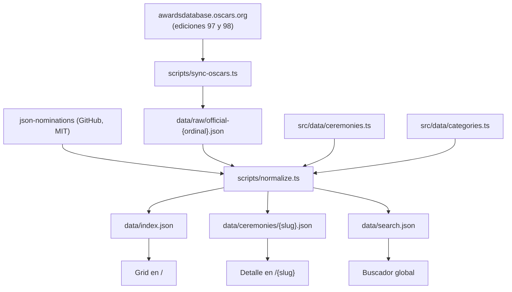

# Oscars Winners — Especificación técnica

Documento listo para desarrollo. Consolida las decisiones de producto, la arquitectura, el manejo de datos, el manejo de errores y el plan de pruebas.

- **Estado**: scaffold inicial hecho, pipeline de datos y UI pendientes (ver [15. Estado actual](#15-estado-actual-del-repositorio)).
- **Última actualización**: 16 de septiembre de 2026.

---

## 1. Objetivo y alcance

### 1.1 Problema

Consultar quién ganó los Oscars de un año determinado hoy requiere preguntarle a una IA año por año, buscar en Google o navegar la web oficial con varios clicks. No existe una vista única, rápida y confiable de toda la historia.

### 1.2 Objetivo

Una sola pantalla desde la que cualquier persona llegue a los ganadores de cualquier edición **en dos clicks**, con los nominados disponibles pero deliberadamente en segundo plano.

### 1.3 Alcance

**Dentro del alcance:**

- Exclusivamente los Academy Awards. No Emmys, Globos de Oro ni ningún otro premio.
- Las 98 ediciones, desde la 1ª (1929) hasta la 98ª (2026).
- Todas las categorías que existieron en cada edición, incluidas las extintas.
- Todos los nominados de cada categoría, no solo los ganadores.

**Fuera del alcance:**

- Cuentas de usuario, favoritos, comentarios o cualquier función social.
- Páginas de perfil por persona o por película (posible fase 3).
- Predicciones, apuestas o cobertura de nominaciones antes de la ceremonia.
- Cualquier premio que no sea el Oscar.

### 1.4 Criterios de aceptación del producto

| # | Criterio |
|---|---|
| A1 | Desde la carga inicial, ver los ganadores principales de cualquier edición toma como máximo 2 interacciones (hover o tap, y click). |
| A2 | La pantalla principal muestra las 98 ediciones sin pasos intermedios de navegación. |
| A3 | Cada edición tiene una URL propia, compartible e indexable. |
| A4 | El ganador de cada categoría es visualmente dominante; los nominados son legibles pero secundarios. |
| A5 | Los datos de las 98 ediciones son verificables contra la base oficial del Academy. |
| A6 | El sitio es utilizable en móvil, donde no existe hover. |

---

## 2. Decisiones cerradas

| Tema | Decisión |
|---|---|
| Alcance de datos | 98 ediciones, todas las categorías de cada época, todos los nominados |
| Arquitectura | Sitio 100% estático, JSON pre-generado en build, sin base de datos ni backend |
| Stack | Next.js 15 (App Router), TypeScript, Tailwind v4, Motion |
| Hosting | Vercel |
| Etiqueta de año | Año de la **ceremonia** en grande; edición y año de películas en letra chica |
| Idioma de la UI | Solo inglés |
| Nombres de categoría | Fieles a la época (ver [5.3](#53-etiquetas-por-época)) |
| Estética | Art Déco, negro profundo y dorado metálico, serif display de alto contraste |
| Hover | Rotación secuencial de los 4 ganadores clave |
| Pósters | Solo Mejor Película, descargados en build, nunca en runtime |
| Actualización anual | Comando CLI manual con diff previo a commit |
| Fuente de datos | Híbrida: base histórica en JSON + scraper oficial del Academy |

### 2.1 Justificación de las decisiones no obvias

**Por qué estático y no base de datos.** Los datos son de solo lectura, cambian una vez al año y pesan menos de 3 MB. Una base de datos agregaría un servidor que mantener y latencia en cada consulta, justo lo contrario del objetivo. El costo de hosting baja a cero y la latencia queda limitada al CDN.

**Por qué el año de ceremonia y no el de las películas.** La gente busca "ganadores Oscars 2026", no "ganadores de las películas de 2025". La convención oficial del Academy es la contraria, así que el año de películas se muestra siempre como subtítulo para evitar ambigüedad.

**Por qué no generar los datos con IA.** Son ~12.000 registros. A esa escala el riesgo de datos inventados es inaceptable para un producto cuya única propuesta de valor es la confiabilidad.

**Por qué no hay drill-down por década.** Añadiría un click a la ruta crítica, rompiendo el criterio A1.

---

## 3. Arquitectura

### 3.1 Flujo de datos



El punto clave es que todo lo de arriba de `normalize.ts` ocurre **fuera del ciclo de vida del sitio**. La aplicación solo consume los tres JSON generados, que están versionados en el repositorio.

### 3.2 Por qué los datos generados se commitean

Los artefactos en `data/` se versionan en git a propósito, por tres razones:

1. El build no depende de que GitHub ni el sitio del Academy estén disponibles.
2. Todo cambio en los datos aparece como un diff revisable en un PR.
3. Hace el build reproducible: el mismo commit produce siempre el mismo sitio.

### 3.3 Estructura de directorios

```
oscars/
├── data/                          # Artefactos generados, versionados
│   ├── index.json                 # Datos del grid (ligero)
│   ├── search.json                # Índice de búsqueda
│   ├── ceremonies/{slug}.json     # 98 archivos de detalle
│   └── raw/official-{n}.json      # Salida cruda normalizada del scraper
├── scripts/
│   ├── lib/
│   │   ├── cache.ts               # Descarga con caché en .cache/
│   │   └── parse-official.ts      # Parser cheerio de la base oficial
│   ├── normalize.ts               # Build principal de datos
│   ├── sync-oscars.ts             # CLI de actualización anual
│   └── fetch-posters.ts           # Descarga de pósters desde TMDB
├── src/
│   ├── app/
│   │   ├── layout.tsx
│   │   ├── page.tsx               # Grid
│   │   ├── [slug]/page.tsx        # Detalle por edición
│   │   ├── not-found.tsx
│   │   ├── sitemap.ts
│   │   └── globals.css            # Tokens de diseño
│   ├── components/
│   ├── data/
│   │   ├── ceremonies.ts          # Tabla curada de 98 ediciones
│   │   └── categories.ts          # Diccionario canónico
│   └── lib/
│       ├── types.ts
│       └── ceremony-data.ts       # Acceso a los JSON generados
├── public/posters/
└── spec.md
```

### 3.4 Scripts de npm

| Comando | Función |
|---|---|
| `npm run dev` | Servidor de desarrollo |
| `npm run build` | `data:check` y luego `next build` |
| `npm run data:build` | Regenera todo `data/` desde las fuentes |
| `npm run data:check` | Valida `data/` sin reescribirlo; falla el build si hay problemas |
| `npm run sync:oscars -- <ordinal>` | Trae una edición desde la base oficial y muestra el diff |
| `npm run posters` | Descarga los pósters faltantes desde TMDB |
| `npm run test` | Pruebas unitarias y de integridad de datos |
| `npm run test:e2e` | Pruebas end-to-end |

`npm run build` **no** descarga nada de la red. Solo valida y compila.

---

## 4. Fuentes de datos

### 4.1 Base histórica

[`delventhalz/json-nominations`](https://github.com/delventhalz/json-nominations), licencia MIT.

Verificado el 16/09/2026: **10.568 registros, 34 categorías distintas, cobertura desde 1927/28 hasta el año de películas 2023**.

```json
{
  "category": "Best Actress",
  "year": "2023",
  "nominees": ["Emma Stone"],
  "movies": [{ "title": "Poor Things", "tmdb_id": 792307, "imdb_id": "tt14230458" }],
  "won": true
}
```

`year` es el **año de las películas**, no el de la ceremonia. Se une a la tabla de ceremonias por `filmYearLabel`.

### 4.2 Hallazgos críticos sobre esta fuente

Estos cuatro puntos condicionan todo el pipeline y fueron verificados contra los datos reales:

1. **Le faltan las dos ediciones más recientes.** Termina en el año de películas 2023, es decir la 96ª ceremonia (marzo 2024). No tiene la 97ª ni la 98ª, que son justamente las más buscadas. **La ingesta desde la fuente oficial no es opcional, es parte del MVP.**

2. **Las categorías ya vienen canonicalizadas a nombres modernos**, no históricos. Son 34 nombres para 98 años, en lugar de las ~90 variantes que tiene la base oficial. Simplifica el mapeo pero exige reconstruir las etiquetas de época.

3. **Los buckets "(Color)" absorbieron las categorías unificadas.** `Best Cinematography (Color)` abarca 1936-2023 aunque la división Color/Blanco y Negro terminó en 1967. Sin corrección, el sitio mostraría "Best Costume Design (Color)" en 2023, que es falso.

4. **No incluye premios honorarios ni especiales** (Honorary Award, Irving G. Thalberg, Jean Hersholt, Special Achievement). El grupo `special` quedará vacío salvo que se decida traerlos de la fuente oficial.

### 4.3 Fuente oficial

`awardsdatabase.oscars.org`. Es la fuente de verdad y no tiene API pública. Se consulta vía un endpoint que devuelve HTML:

```
GET https://awardsdatabase.oscars.org/search/getresults
    ?query={"AwardShowNumberFrom":98,"AwardShowNumberTo":98,"Sort":"3-Award Category-Chron","Search":30}
```

Notas de implementación:

- Se parsea con `cheerio`.
- Los resultados vienen agrupados por categoría en orden cronológico; el ganador se marca con un icono de estatuilla, que en el HTML es una clase CSS. **Esa clase es el punto más frágil del scraper y debe estar aislada en una sola constante de `parse-official.ts`.**
- El orden nombre/película se invierte según la categoría: en las de actuación viene la persona primero y la película después; en otras al revés. El parser necesita esa lógica por categoría.
- Requiere `user-agent` identificable y descarga cacheada en `.cache/`. Una petición por edición, nunca en build.

### 4.4 Fallback

El CSV de Kaggle `unanimad/the-oscar-award` ya cubre 1927-2026 y sirve para desbloquear el MVP si el scraper se complica. Requiere descarga manual con cuenta de Kaggle. Si se usa, debe quedar registrado en el repo de dónde salió cada edición.

### 4.5 Pósters

TMDB, usando el `tmdb_id` que ya viene en la base histórica. Solo para el ganador de Mejor Película de cada edición (98 imágenes). Se descargan una vez a `public/posters/{tmdbId}.webp` mediante `npm run posters`. La API key vive en `.env.local` y **solo se usa en ese script**, nunca en el runtime del sitio.

### 4.6 Nota legal

"Oscars", "Academy Awards" y la silueta de la estatuilla son marcas registradas de AMPAS, que las defiende activamente.

- El dominio no debe ser confundible con uno oficial. `oscarsawards.com` es un riesgo real; conviene algo descriptivo y distinto.
- El diseño **no debe usar la estatuilla ni su silueta**. La estética Art Déco es de dominio público y cumple el mismo objetivo.
- El footer debe llevar un disclaimer de sitio no oficial y atribución a las fuentes de datos, incluido el crédito a TMDB que su licencia exige.

---

## 5. Modelo de datos

### 5.1 Tipos

Definidos en `src/lib/types.ts` y compartidos entre los scripts y la aplicación.

```ts
type Ceremony = {
  ordinal: number;        // 1..98
  ceremonyYear: number;   // 2026
  ceremonyDate: string;   // "2026-03-15"
  filmYearLabel: string;  // "2025" | "1927/28"
  slug: string;           // "2026" | "1930-2nd"
  decade: string;         // "2020s"
};

type Movie = { title: string; tmdbId?: number; imdbId?: string };
type Entry = { names: string[]; movies: Movie[] };

type CeremonyCategory = {
  id: string;        // "best-picture"
  label: string;     // etiqueta de la época
  winners: Entry[];  // array: hubo empates
  nominees: Entry[]; // solo los que no ganaron
};

type CeremonyDetail = {
  ceremony: Ceremony;
  groups: { id: CategoryGroup; label: string; categories: CeremonyCategory[] }[];
};

type GridEntry = {
  slug: string; label: string; subtitle: string;
  decade: string; ordinal: number;
  headline: { category: string; winner: string; movie?: string }[];
  posterPath?: string;
};
```

`winners` y `names` son arrays por razones de datos reales, no por sobreingeniería: hubo empates en varias categorías y hay nominaciones compartidas entre varias personas.

### 5.2 Separación de artefactos

Esta es la decisión de rendimiento central:

| Archivo | Contenido | Tamaño esperado | Cuándo se carga |
|---|---|---|---|
| `data/index.json` | 98 `GridEntry`, solo los 4 ganadores clave | pocos KB | Siempre, con el grid |
| `data/ceremonies/{slug}.json` | Detalle completo de una edición | ~10-40 KB | Solo al abrir esa edición |
| `data/search.json` | Índice de búsqueda | ~300 KB | Diferido, al abrir el buscador |

El grid nunca carga los 2,9 MB completos.

### 5.3 Etiquetas por época

Decisión: las etiquetas deben ser **fieles al nombre que la categoría tenía ese año**. Se implementa como `resolveCategoryLabel(categoryId, filmYear)` en `src/data/categories.ts`, con una tabla de reglas.

Para los años partidos ("1927/28"), `filmYear` es el año final (1928).

| Categoría canónica | Regla por año de películas |
|---|---|
| `best-cinematography` | ≤1966 → "Best Cinematography (Color)"; ≥1967 → "Best Cinematography" |
| `best-cinematography-bw` | "Best Cinematography (Black and White)" |
| `best-production-design` | ≤1966 → "Best Art Direction (Color)"; 1967-2011 → "Best Art Direction"; ≥2012 → "Best Production Design" |
| `best-production-design-bw` | "Best Art Direction (Black and White)" |
| `best-costume-design` | ≤1966 → "Best Costume Design (Color)"; ≥1967 → "Best Costume Design" |
| `best-costume-design-bw` | "Best Costume Design (Black and White)" |
| `best-international-feature` | ≤2018 → "Best Foreign Language Film"; ≥2019 → "Best International Feature Film" |
| `best-makeup-hairstyling` | ≤2011 → "Best Makeup"; ≥2012 → "Best Makeup and Hairstyling" |
| `best-visual-effects` | ≤1962 → "Best Special Effects"; ≥1963 → "Best Visual Effects" |
| `best-sound` | ≤1957 → "Best Sound Recording"; 1958-2007 → "Best Sound"; 2008-2019 → "Best Sound Mixing"; ≥2020 → "Best Sound" |
| `best-sound-editing` | ≤1976 → "Best Sound Effects"; 1977-1999 → "Best Sound Effects Editing"; ≥2000 → "Best Sound Editing" |
| `best-documentary-feature` | ≤2021 → "Best Documentary Feature"; ≥2022 → "Best Documentary Feature Film" |
| `best-live-action-short` | ≤1956 → "Best Live Action Short Film (One Reel)"; ≥1957 → "Best Live Action Short Film" |
| `best-live-action-short-two-reel` | "Best Live Action Short Film (Two-Reel)" |
| `best-score-musical-adaptation` | "Best Score (Musical or Adaptation)" |

> **Tarea de verificación obligatoria.** Los años de corte de esta tabla provienen de conocimiento general y **deben confirmarse uno por uno contra `awardsdatabase.oscars.org`** antes de publicar. Cualquier discrepancia se corrige en esta tabla, no en el código que la consume.

**Dos excepciones deliberadas**, donde se prioriza que el usuario encuentre lo que busca sobre la fidelidad histórica:

- `best-picture` se muestra siempre como "Best Picture", aunque en distintas épocas se llamó "Outstanding Picture", "Outstanding Production" y "Best Motion Picture".
- Las categorías de actuación se muestran como "Best Actor" / "Best Supporting Actress", no con el nombre oficial "Actor in a Leading Role".

Ambas quedan documentadas en un comentario en `categories.ts`.

### 5.4 Diccionario canónico de categorías

`src/data/categories.ts` mapea cada nombre de entrada a un id canónico, un grupo y un orden. Cada categoría declara `aliases` normalizados que cubren **tanto** los nombres del dataset histórico **como** los de la base oficial (`ACTOR IN A LEADING ROLE`, `MUSIC (ORIGINAL SCORE)`, `WRITING (ADAPTED SCREENPLAY)`, etc.).

Normalización de alias: mayúsculas, espacios colapsados, puntuación eliminada.

| Grupo | Etiqueta en UI | Categorías canónicas (en orden) |
|---|---|---|
| `headline` | The Big Two | `best-picture`, `best-director` |
| `acting` | Acting | `best-actor`, `best-actress`, `best-supporting-actor`, `best-supporting-actress` |
| `writing` | Writing | `best-original-screenplay`, `best-adapted-screenplay`, `best-original-story` |
| `feature` | Features | `best-animated-feature`, `best-international-feature`, `best-documentary-feature` |
| `craft` | Crafts | `best-cinematography`, `best-cinematography-bw`, `best-film-editing`, `best-production-design`, `best-production-design-bw`, `best-costume-design`, `best-costume-design-bw`, `best-makeup-hairstyling`, `best-visual-effects`, `best-sound`, `best-sound-editing`, `best-casting` |
| `music` | Music | `best-original-score`, `best-score-musical-adaptation`, `best-original-song` |
| `shorts` | Short Films | `best-animated-short`, `best-live-action-short`, `best-live-action-short-two-reel`, `best-live-action-short-color`, `best-documentary-short` |
| `retired` | Retired Categories | `best-assistant-director`, `best-dance-direction`, `unique-artistic-production` |
| `special` | Special Awards | vacío por ahora |

Total: 35 ids canónicos (los 34 del dataset más `best-casting`, nueva en la 98ª edición).

**Criterio de agrupación:** los grupos reflejan la *naturaleza* de la categoría, no si está extinta. Por eso `best-cinematography-bw` vive en `craft` y no en `retired`: en la vista de 1960 tiene que aparecer junto a la versión en color. `retired` se reserva para categorías sin equivalente moderno alguno.

### 5.5 Casos borde de datos

Todos deben tener una prueba asociada.

| Caso | Manejo |
|---|---|
| 1930 tuvo dos ceremonias (2ª en abril, 3ª en noviembre) | Ambas reciben slug sufijado: `1930-2nd` y `1930-3rd`. Ninguna ocupa el `/1930` a secas |
| No hubo ceremonia en 1933 | La tabla es una lista de fechas reales, así que 1933 simplemente no existe |
| Las 6 primeras ediciones honran años partidos | Solo afecta `filmYearLabel` ("1927/28") |
| La 1ª edición es la única de los años 20 | El grid tendrá un grupo "1920s" con un solo recuadro. Aceptado |
| Empates con varios ganadores | `winners` es un array y la UI los renderiza todos |
| Nominaciones compartidas entre personas | `Entry.names` es un array |
| Una nominación por varias películas | `Entry.movies` es un array |
| Una nominación sin película (un caso, un programa de TV) | `movies` vacío debe renderizar sin romper |
| Categorías que solo existieron 2-5 años | Se muestran normalmente en las ediciones que corresponde |
| Categoría nueva no vista antes | El build **falla** con el nombre exacto sin mapear |

---

## 6. Pantalla principal (`/`)

- Grid responsive con las 98 ediciones, de la más reciente a la más antigua.
- Separadores **sticky por década** ("2020s", "2010s"...).
- Navegación de décadas persistente: barra superior en desktop, chips con scroll horizontal en móvil. Hace scroll suave dentro de la misma página, sin navegar.
- Cada recuadro es un `<Link href="/{slug}">`, no un botón. Así es rastreable por buscadores, permite abrir en pestaña nueva y funciona con el botón atrás.
- Cabecera sobria con el nombre del sitio y el buscador. Footer con disclaimer y atribuciones.

### 6.1 Anatomía del recuadro

En reposo: el año de la ceremonia en grande, y debajo en letra chica "98th Ceremony — Films of 2025".

En hover: rotan secuencialmente con fade y desplazamiento los 4 ganadores clave, en este orden fijo: **Mejor Película, Director, Actor, Actriz**. Cada uno visible ~1,6 s.

### 6.2 Restricciones de implementación del hover

Son requisitos, no sugerencias:

1. **Solo la tarjeta con hover monta su temporizador.** Con 98 recuadros, montar un intervalo por tarjeta degrada el rendimiento y agota la batería. El temporizador se crea en `mouseenter` y se destruye en `mouseleave`.
2. Al salir el mouse, la tarjeta vuelve al estado de reposo y la rotación se reinicia desde Mejor Película.
3. Con `prefers-reduced-motion: reduce` no hay rotación: se muestran los 4 ganadores estáticos.
4. Las ediciones antiguas pueden no tener las 4 categorías (Actor de Reparto no existe antes de 1936). La rotación usa solo las disponibles y **nunca muestra un hueco vacío**.

---

## 7. Detalle por edición (`/{slug}`)

Ruta prerenderizada con `generateStaticParams()` sobre los 98 slugs. Se presenta como overlay sobre el grid, de modo que es simultáneamente un modal navegable y una página compartible e indexable.

### 7.1 Contenido

- Cabecera: año de ceremonia, número de edición, año de películas, fecha exacta y póster de Mejor Película.
- Categorías agrupadas según [5.4](#54-diccionario-canónico-de-categorías), empezando por el bloque destacado.
- Por categoría: **ganador en tipografía grande y dorada**; nominados debajo, en gris, tamaño reducido, sin competir por la atención.
- Índice sticky de grupos al costado en desktop.

### 7.2 Interacción

| Acción | Resultado |
|---|---|
| Flechas de anterior/siguiente | Navega de edición sin cerrar el overlay |
| `←` / `→` | Igual que las flechas |
| `Esc` | Cierra y vuelve al grid |
| Click fuera del contenido | Cierra |
| Entrada directa por URL | Renderiza la página completa; cerrar lleva a `/` |

En los extremos (1ª y 98ª edición) la flecha correspondiente se deshabilita, no se oculta, para que el layout no salte.

Requisitos de accesibilidad del overlay: foco atrapado mientras está abierto, foco devuelto a la tarjeta de origen al cerrar, `aria-modal` y scroll del fondo bloqueado.

### 7.3 Móvil

Overlay a pantalla completa, índice de grupos colapsado en un desplegable, y navegación entre ediciones también por swipe además de las flechas.

---

## 8. Sistema de diseño

### 8.1 Tokens

Definidos como variables CSS en `src/app/globals.css`.

| Token | Valor | Uso |
|---|---|---|
| `--color-ink` | `#0A0908` | Fondo base |
| `--color-surface` | `#141210` | Recuadros y overlay |
| `--color-gold` | `#C9A227` | Acento principal, años |
| `--color-gold-light` | `#E8C96A` | Ganadores, estados hover |
| `--color-muted` | por definir | Nominados. **Debe cumplir contraste AA (≥4.5:1) sobre `--color-surface`** |

### 8.2 Tipografía

Vía `next/font`, con `display: swap` y subsetting.

- **Playfair Display**: años, nombres de ganadores, títulos. Serif de alto contraste, coherente con la época.
- **Inter**: elementos de interfaz, nominados, metadatos.

### 8.3 Motivos Art Déco

Marcos geométricos de 1 px, separadores de década con motivo de rayos, y una textura de grano muy sutil. Todo con CSS o SVG inline; sin imágenes de fondo pesadas. **Sin la estatuilla ni su silueta** (ver [4.6](#46-nota-legal)).

### 8.4 Accesibilidad

- Contraste AA en todo el texto. El punto de fallo típico de esta paleta son los nominados en gris sobre negro, así que ese valor se audita explícitamente.
- Foco visible y con estilo propio en todos los elementos interactivos.
- Toda la navegación operable por teclado.
- `prefers-reduced-motion` respetado en las animaciones del grid y del overlay.
- La información nunca se transmite solo por color: el ganador se distingue también por tamaño y jerarquía, no únicamente por ser dorado.

---

## 9. Búsqueda global

Sobre `data/search.json`, pre-generado y cargado de forma diferida al abrir el buscador.

- Busca por año, título de película y nombre de persona.
- Resultados agrupados por tipo, mostrando la edición a la que pertenecen y si ganó o fue nominado.
- Normaliza acentos y mayúsculas, para que "Amelie" encuentre "Amélie".
- Enter sobre un resultado abre el detalle de esa edición.
- Accesible por teclado con `/` para enfocar, flechas para recorrer y `Esc` para cerrar.

---

## 10. Manejo de errores

La regla general: **los errores de datos se detectan en build y rompen el build; en runtime el sitio no puede fallar** porque solo consume JSON ya validados.

### 10.1 En build

| Situación | Comportamiento |
|---|---|
| Categoría sin mapear en el diccionario | **Falla** el build listando los nombres exactos no reconocidos y en qué ediciones aparecen |
| `year` del dataset que no une con ninguna ceremonia | **Falla** indicando el valor huérfano |
| Una edición queda sin ninguna categoría | **Falla**: indica que la unión se rompió |
| Una edición no tiene ganador de Mejor Película | **Falla**, salvo que esté en una lista explícita de excepciones justificadas |
| Una categoría queda sin ningún ganador | **Advierte** con el detalle, y falla si supera un umbral configurado |
| Validación Zod de los artefactos generados | **Falla** mostrando la ruta exacta del campo inválido |
| Conteo de nominados por edición muy fuera de rango | **Advierte** para revisión manual |
| Póster faltante para un Mejor Película | **Advierte**; la UI usa un marcador tipográfico como fallback |

El motivo de ser tan estricto es concreto: el único valor del sitio es que los datos sean correctos, así que es preferible un build roto a publicar datos mal agrupados en silencio.

### 10.2 En el scraper

| Situación | Comportamiento |
|---|---|
| Respuesta HTTP no exitosa | Reintenta con backoff exponencial, 3 intentos; luego aborta con el código de estado |
| Cambió el HTML y no se encuentran categorías | Aborta sin escribir nada, e indica que el parser necesita actualizarse |
| No se detecta ningún ganador | Aborta: casi con certeza cambió la clase CSS del icono de estatuilla |
| La edición trae muchas menos categorías de lo esperado | Escribe el archivo pero marca la salida como sospechosa en el diff |
| La edición ya existe en `data/raw/` | Muestra el diff y **exige confirmación explícita** antes de sobrescribir |

El scraper **nunca** escribe directamente los artefactos finales. Escribe `data/raw/official-{ordinal}.json`, y `normalize.ts` es el único que produce `data/`.

### 10.3 En runtime

| Situación | Comportamiento |
|---|---|
| Slug inexistente | `not-found.tsx` con estética propia y enlace de vuelta al grid |
| Slug ambiguo como `/1930` | Redirige a la primera de las dos ediciones de ese año, con un aviso que ofrece la otra |
| Categoría sin nominados además del ganador | Renderiza solo el ganador, sin encabezado de nominados vacío |
| Póster que no carga | Fallback tipográfico con el título |
| Falla la carga diferida del índice de búsqueda | El buscador informa el problema y permite reintentar; el resto del sitio sigue funcionando |
| JavaScript deshabilitado | El grid y las 98 páginas de detalle siguen siendo navegables porque son enlaces y páginas reales. Se pierde solo la animación del hover |

---

## 11. Plan de pruebas

Vitest para unitarias e integridad de datos, Testing Library para componentes, Playwright para end-to-end.

### 11.1 Integridad de datos (prioridad máxima)

Corren en CI y bloquean el merge. Son la red de seguridad del producto.

| # | Prueba |
|---|---|
| D1 | La tabla de ceremonias tiene exactamente 98 entradas |
| D2 | Los `slug` son únicos; los `ordinal` son 1..98 sin huecos |
| D3 | Las fechas de ceremonia son estrictamente crecientes |
| D4 | 1930 produce dos ediciones con slugs distintos y ninguna ocupa `/1930` |
| D5 | No existe ninguna edición en 1933 |
| D6 | Los `filmYearLabel` son únicos y las 6 primeras ediciones usan formato con barra |
| D7 | Existe un archivo de detalle por cada uno de los 98 slugs |
| D8 | Ningún nombre de categoría del dataset queda sin mapear |
| D9 | Todo id canónico usado pertenece a un grupo declarado |
| D10 | Toda categoría de todo detalle tiene al menos un ganador |
| D11 | Ningún nominado aparece simultáneamente en `winners` y `nominees` de la misma categoría |
| D12 | Cada `GridEntry` tiene al menos un ganador destacado |
| D13 | El total de nominaciones en los detalles coincide con el total de registros de entrada |
| D14 | Todos los artefactos pasan la validación Zod |
| D15 | `index.json` se mantiene bajo un presupuesto de tamaño definido |

### 11.2 Verificación puntual contra la fuente oficial

Un conjunto pequeño de aserciones sobre datos conocidos, que detecta desalineaciones de la unión año/ceremonia mejor que cualquier prueba estructural:

| Edición | Verificación |
|---|---|
| 1ª (`1929`) | Mejor Película es "Wings"; existe "Unique and Artistic Production" |
| 3ª (`1930-3rd`) | Es una edición distinta de la 2ª, con ganadores distintos |
| 41ª (1968) | Empate en Mejor Actriz: Katharine Hepburn y Barbra Streisand |
| 92ª (2020) | Mejor Película es "Parasite" y la etiqueta de categoría internacional ya es "International Feature Film" |
| 96ª (2024) | Mejor Película es "Oppenheimer" |
| 98ª (2026) | La edición existe y proviene de la fuente oficial, no de la base histórica |
| 1955 | La categoría de vestuario se etiqueta "(Color)" y "(Black and White)", no unificada |
| 2023 | La categoría de vestuario se etiqueta "Best Costume Design", sin sufijo de color |

La última pareja es la prueba de regresión directa del hallazgo 3 de [4.2](#42-hallazgos-críticos-sobre-esta-fuente).

### 11.3 Unitarias

- `ordinalSuffix`: 1st, 2nd, 3rd, 11th, 21st, 98th.
- `resolveCategoryLabel`: para cada regla de [5.3](#53-etiquetas-por-época), un caso antes del corte, uno en el corte y uno después.
- Normalización de alias: variantes de mayúsculas, espacios y puntuación llegan al mismo id.
- `ceremonyByFilmYear` con años partidos.
- Normalización de texto del buscador con acentos.

### 11.4 Componentes

- El recuadro muestra el año y el subtítulo en reposo.
- El temporizador de rotación se monta en `mouseenter` y **se limpia en `mouseleave`** (regresión de la restricción de rendimiento).
- Con `prefers-reduced-motion` no se monta ningún temporizador.
- Una edición sin las 4 categorías clave rota solo las disponibles, sin huecos.
- El ganador se renderiza con jerarquía distinta a los nominados.
- Una categoría sin nominados no renderiza encabezado vacío.
- Los empates renderizan todos los ganadores.
- Una nominación sin película no rompe el render.

### 11.5 End-to-end

| # | Escenario |
|---|---|
| E1 | Cargar `/`, hacer hover en un recuadro, ver rotar los ganadores |
| E2 | Click en un recuadro abre el overlay con la URL `/{slug}` |
| E3 | Las flechas navegan entre ediciones y la URL acompaña |
| E4 | `Esc` cierra y devuelve a `/` |
| E5 | El botón atrás del navegador funciona en toda la secuencia |
| E6 | Entrar directo a `/1994` renderiza la página completa |
| E7 | Un slug inválido muestra la página de no encontrado |
| E8 | Saltar por década hace scroll a la sección correcta |
| E9 | Buscar "Parasite" lleva a la edición correcta |
| E10 | En viewport móvil, el tap abre el detalle a pantalla completa |
| E11 | Recorrer grid y overlay solo con teclado |
| E12 | Con JavaScript deshabilitado, el grid y el detalle siguen navegables |

### 11.6 Rendimiento y accesibilidad

- Presupuesto Lighthouse: Rendimiento ≥95, Accesibilidad 100, SEO ≥95, en móvil.
- Auditoría automatizada de contraste con `axe`, con foco en los nominados en gris.
- Verificar que hacer hover sobre muchos recuadros en secuencia no deja temporizadores vivos.

---

## 12. SEO

- `generateMetadata` por edición, con títulos del tipo "2026 Oscar Winners — 98th Academy Awards".
- Open Graph e imagen social por edición.
- `sitemap.ts` con las 98 rutas más la raíz.
- JSON-LD por edición describiendo el evento y sus premios.
- URLs limpias y estables: el slug es parte del contrato público y **no debe cambiar** una vez publicado.

---

## 13. Fases de entrega

### MVP

1. Diccionario canónico de categorías con las etiquetas por época y su tabla de reglas verificada.
2. `normalize.ts`: une la base histórica con ceremonias y categorías, y falla ante cualquier dato no reconocido.
3. Ingesta de las ediciones 97ª y 98ª desde la fuente oficial. **Bloqueante**: sin esto el sitio no responde la consulta más frecuente.
4. Generación y validación de `data/index.json` y los 98 detalles.
5. Tokens de diseño, tipografías y layout base.
6. Grid con separadores por década y navegación de décadas.
7. Animación de hover con las restricciones de rendimiento de [6.2](#62-restricciones-de-implementación-del-hover).
8. Ruta de detalle con agrupación, navegación y accesibilidad.
9. Adaptación a móvil.
10. SEO, disclaimer legal y auditoría de contraste.

### Fase 2

11. Buscador global.
12. Pósters desde TMDB.
13. CLI `sync:oscars` pulido, con diff legible, listo para la 99ª ceremonia de 2027.

### Ideas para fase 3

Páginas por persona y por película, estadísticas históricas, filtros por categoría a lo largo del tiempo.

---

## 14. Procedimiento de actualización anual

Ejecutado manualmente después de cada ceremonia. La decisión de que sea manual es deliberada: son datos que no admiten errores y merecen revisión humana.

```bash
npm run sync:oscars -- 99    # trae la 99ª desde la base oficial
git diff data/raw/           # revisar la salida cruda
npm run data:build           # regenerar artefactos
npm run test                 # integridad de datos
npm run posters              # póster del nuevo Mejor Película
git diff data/               # revisar el diff final
```

Antes de correrlo hay que **añadir la fecha de la nueva ceremonia** a `CEREMONY_DATES` en `src/data/ceremonies.ts`. Es el único dato que se escribe a mano cada año.

Si la ceremonia introduce una categoría nueva, el build fallará a propósito con el nombre exacto sin mapear, que es la señal para añadirla al diccionario con su grupo y su orden.

---

## 15. Estado actual del repositorio

Commit inicial `6798d39`. Hecho:

- Proyecto Next.js 15 con TypeScript, Tailwind v4, App Router y `src/`. Dependencias instaladas: `motion`, `zod`, `tsx`, `cheerio`.
- `src/lib/types.ts`: modelo de datos completo de [5.1](#51-tipos).
- `src/data/ceremonies.ts`: las 98 ediciones, derivadas de la lista de fechas reales. Verificado: 98 entradas, 98 slugs únicos, orden cronológico correcto, el par de 1930 desambiguado.
- `scripts/lib/cache.ts`: descarga con caché en `.cache/`, ya ignorado por git.
- Base histórica descargada y analizada, de donde salen los hallazgos de [4.2](#42-hallazgos-críticos-sobre-esta-fuente).

Pendiente: todo lo demás, empezando por el punto 1 del MVP.

El boilerplate de `create-next-app` en `src/app/page.tsx` y `globals.css` sigue intacto y debe reemplazarse.
